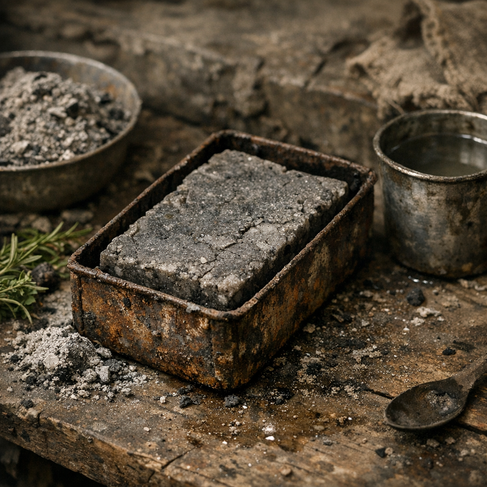

# Ascheseife

Das Standardmittel gegen Ruß, Schweiß, Tierfett und jenen dicken Lagerfilm, der aus allem irgendwann eine Krankheit machen will. Niemand nennt sie angenehm. Aber wer sie regelmäßig nutzt, stinkt später krank als andere.

## Materialien & Herkunft

- feine Holzasche aus Kochstellen, Brennöfen oder der [Pilgerrast](../../Orte/Handelsposten/Pilgerrast.md)
- ausgelassenes Fett aus Küchenresten, Schlachtabfall oder alten Vorräten
- ein halber bis ganzer Becher gefiltertes Wasser aus [Wasserfiltern](../Gegenstaende/Wasserfilter.md)
- nach Möglichkeit ein kleiner Griff [Beifuss](../Pflanzen/Beifuss.md) oder [Wilder Hopfen](../Pflanzen/Wilder-Hopfen.md) gegen Geruch
- eine flache Dose, Schale oder Blechform zum Trocknen

## Herstellung und Anwendung

Die Asche wird mit wenig Wasser zu einer scharfen Lauge gezogen. Danach kommt langsam Fett dazu, bis aus der schmierigen Brühe eine trübe, dickere Masse wird. Wer Kräuter übrig hat, zerreibt sie hinein, damit die Seife nicht nur nach Feuerstelle riecht.

Die Masse wird in flache Dosen gestrichen und mehrere Tage stehen gelassen. Fertig ist sie, wenn sie nicht mehr schwappt, sondern wie weicher Stein aus der Form kommt.

[Hillbillys](../../Kanon/glossar.md#hillbillys) machen sie grob und schnell. Ordensleute kochen sie fast rituell sauber. [Zeros](../../Kanon/glossar.md#zeros) handeln mit besseren Stücken, die weniger die Haut fressen. Gewaschen werden Hände, Achseln, Füße, Leisten, Werkzeuge und notfalls auch Stoffwickel.
