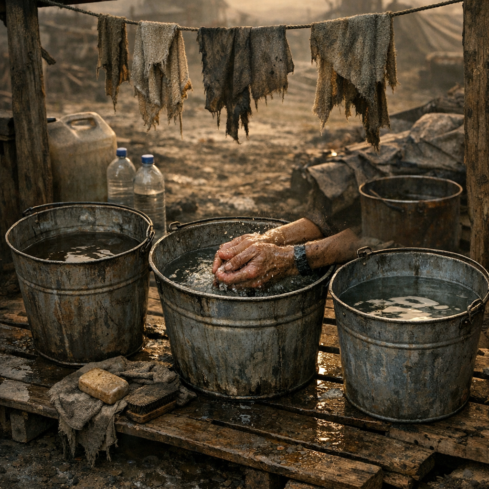

# Drei-Eimer-Waschplatz

Ein funktionierender Waschplatz ist in der [Wasteland](../../Kanon/glossar.md#wasteland) beinahe Zivilisation. Das Drei-Eimer-System spart Wasser, hält Schmutz aus offenen Wunden und ist oft das Erste, was halbwegs geordnete Lager aufbauen.

## Materialien & Herkunft

- drei Eimer, Kanisterhälften oder große Dosen
- Wasser aus [Wasserfiltern](../Gegenstaende/Wasserfilter.md), Regenfängen oder sauberer Tauschware
- etwas [Ascheseife](Ascheseife.md) oder Laugenreste
- Lappen, Bürstenersatz, Stoffstreifen oder ein alter Ärmel
- ein Gestell, Brett oder Steinkante, damit nichts direkt im Schlamm steht

## Aufbau und Anwendung

Der erste Eimer ist für groben Dreck, der zweite für Seife, der dritte nur für klares Nachspülen. Genau diese Reihenfolge hält das wenige saubere Wasser länger brauchbar. Wer alles in einen Bottich kippt, wäscht Schmutz nur im Kreis.

Ordenslager stellen den Waschplatz streng getrennt von Küche und Gebetsraum auf. [Maker](../../Kanon/glossar.md#maker) bauen Ablaufbleche darunter. [Hillbillys](../../Kanon/glossar.md#hillbillys) stellen ihn dort hin, wo das Abwasser nicht direkt zurück ins Lager läuft. In guten Posten gibt es zusätzlich Haken für Lappen und eine kleine Aschewanne zum Desinfizieren von Metallzeug.

Gewaschen werden zuerst Hände und Gesicht, dann Werkzeug, dann Stoffzeug. Füße zuletzt. Alles andere ist Romantik.
