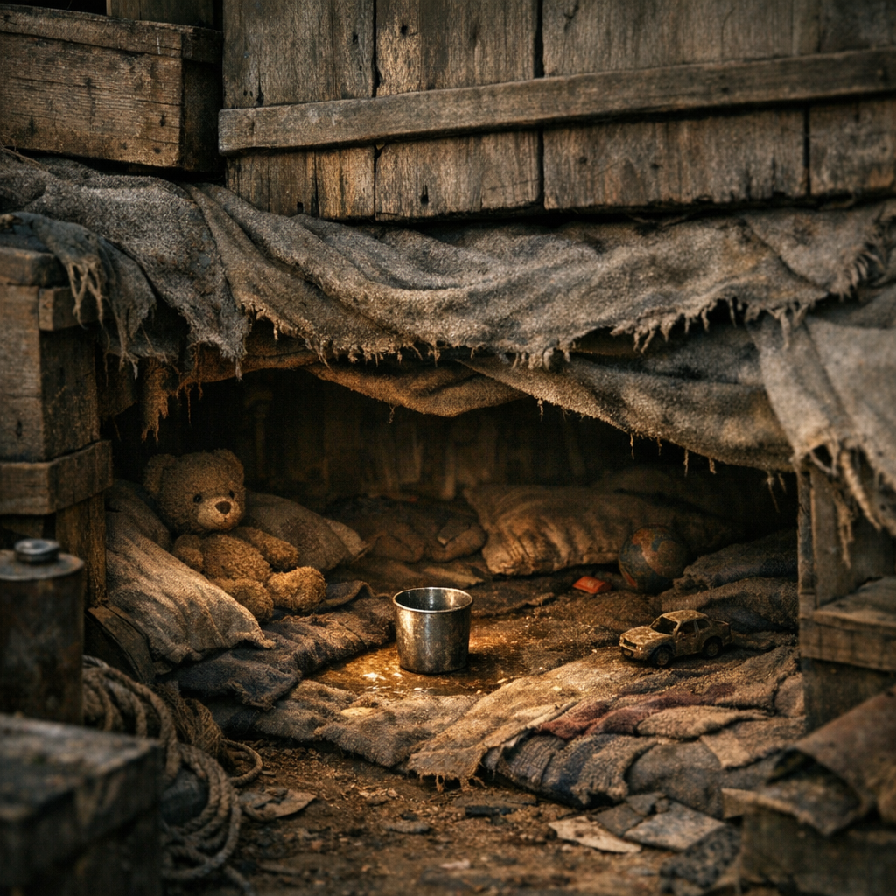

# Kinderversteck

Wenn Schüsse fallen oder ein Lager kippt, braucht es einen Ort, an dem Kinder still verschwinden können. Nicht heldenhaft. Nicht schön. Nur so gebaut, dass kleine Körper nicht als Erstes getroffen, getreten oder verschleppt werden.

## Materialien & Herkunft

- Hohlraum unter Pritschen, in Kistenwänden, hinter Stofflagern oder in falschen Vorratsstapeln
- Decken, Filz, trockene [Moose und Flechten](../Pflanzen/Moose-und-Flechten.md) oder Stoffreste gegen Kälte und Geräusch
- Wasserbecher, ein kleiner Snack, Lappen und ein Nachttopf oder Beutel
- ein stilles Zeichen- oder Klopfsystem für Entwarnung
- im besten Fall eine zweite Fluchtöffnung

## Bau und Nutzung

Ein gutes Kinderversteck ist niedrig, eng und von außen unscheinbar. Innen ist es weich genug, dass Kinder nicht bei jeder Bewegung gegen Metall oder Holz stoßen. Wichtig ist nicht, dass es bequem ist, sondern dass es zwei Stunden Panik aushält.

Viele Lager tarnen solche Räume als Dosenlager oder Schmutzwäscheecke. [Retros](../../Kanon/glossar.md#retros) bauen sie in Möbeln. [Maker](../../Kanon/glossar.md#maker) verstecken sie hinter Kabel- und Werkzeugwänden. [Hillbillys](../../Kanon/glossar.md#hillbillys) setzen eher auf Kellerlöcher und hoffen auf dicke Bretter.

Kinder lernen früh, wann sie hineinmüssen, wie still sie sein müssen und auf welches Signal sie wieder raus dürfen. Traurig daran ist nicht die Technik. Traurig ist, dass sie funktioniert.
