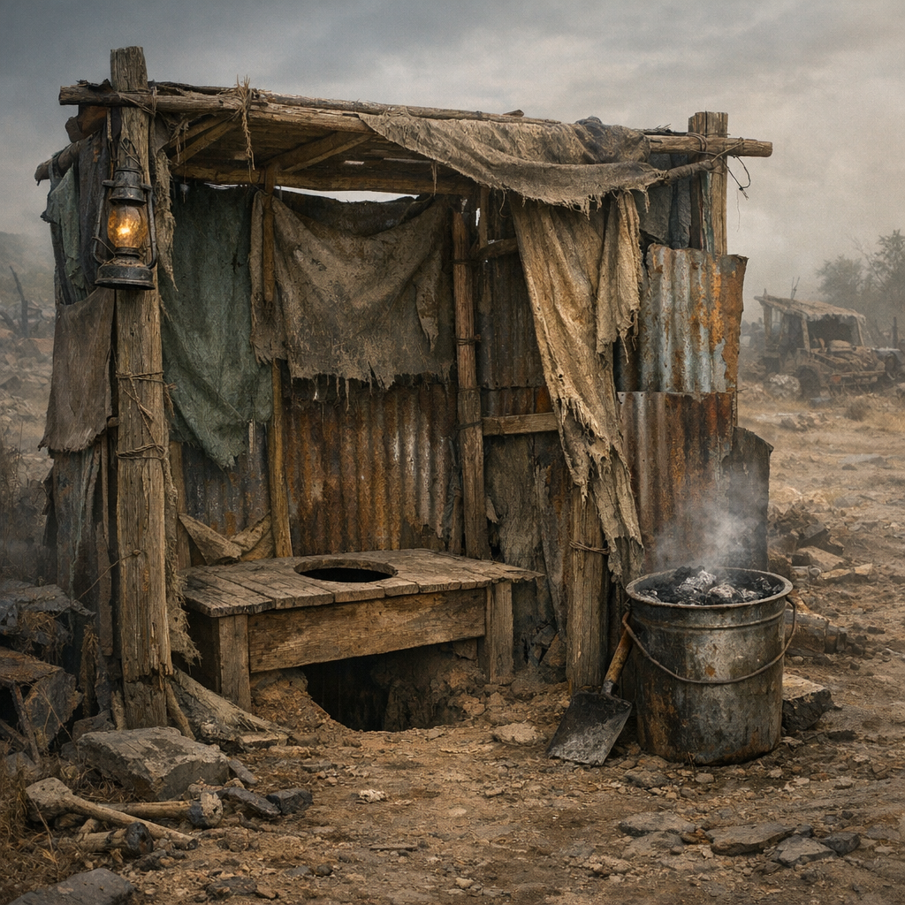

# Latrinenrigg

Eine Latrine ist kein Nebenthema. Wo Menschen länger als zwei Nächte bleiben, entscheidet sie darüber, ob ein Lager aushält oder in Fliegen, Gestank und Fieber versinkt.

## Materialien & Herkunft

- Spatenersatz, Blechschaufel oder Grabstange
- Bretter, Schrottgitter oder stabile Stangen als Sitz- und Trittrand
- Stoffplanen, alte Türen oder Bleche als Sichtschutz
- Asche, trockene Erde oder Kalkreste zum Abdecken
- Markierungen, damit niemand zu nah an Kochstelle, Schlafplatz oder Wassergrube baut

## Bau und Anwendung

Die Grube wird abseits von Feuer, Küche und Schlafstellen angelegt, möglichst tiefer als der Rest des Lagers und nie direkt an Wasserläufen. Darüber kommt ein einfaches Rigg aus Brett, Stange oder Rahmen, damit niemand bei Nacht halb in der eigenen Seuche verschwindet.

Nach jeder Nutzung wird Asche oder trockene Erde nachgeworfen. Das nimmt Geruch, bindet Feuchtigkeit und hält Fliegen etwas besser draußen. Ist die Grube zu voll, wird sie geschlossen und markiert. Daneben kommt die nächste.

[Geocacher](../../Kanon/glossar.md#geocacher) markieren Latrinen oft auf kleinen Lagerkarten. [Der Orden](../../Kanon/glossar.md#der-orden) versieht sie mit strengen Wegen und Reinigungszeiten. [Hillbillys](../../Kanon/glossar.md#hillbillys) ignorieren das gern, bis das Lager nach Scheitern riecht.
