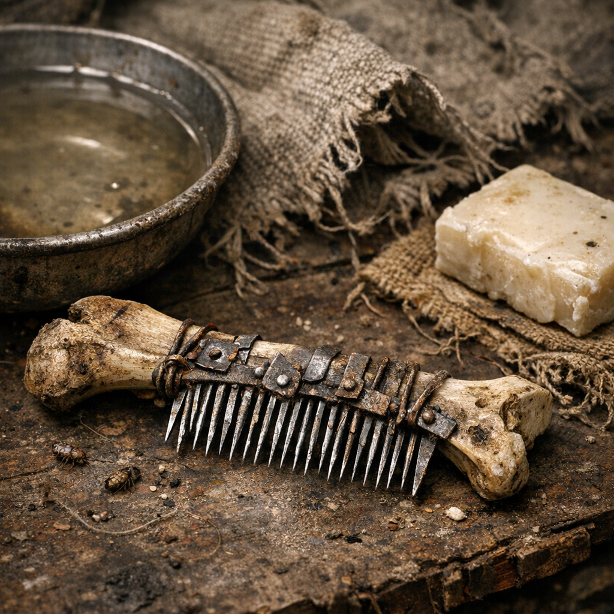

# Lauskamm Schrottzahn

Ein lächerlich simples Werkzeug mit erstaunlich großem Einfluss auf Lagergesundheit, Schlafqualität und Stimmung. Wo viele Menschen eng schlafen, sind Läuse nie weit. Ohne Kamm werden aus Juckreiz offene Stellen, Scham und Streit.

## Materialien & Herkunft

- ein schmaler Metall- oder Knochenträger
- feine Zinken aus Draht, Fischgrätenersatz oder ausgeschliffenem Schrott
- Griffwickel aus Stoff oder Leder
- eine Schale Wasser, etwas [Ascheseife](Ascheseife.md) und notfalls [Beifuss](../Pflanzen/Beifuss.md) zum Reinigen
- gute Augen, Geduld und jemand, der still sitzen kann

## Bau und Anwendung

Die Zinken werden eng gesetzt, damit sie Nissen und Läuse tatsächlich fassen. Danach wird der Kamm langsam Strähne für Strähne durch Haare, Bart oder Tierfell gezogen und nach jedem Zug im Wasser ausgeschlagen. Bei starkem Befall werden Stoffe ausgekocht, Schlafplätze gereinigt und Köpfe wiederholt kontrolliert.

[Retros](../../Kanon/glossar.md#retros) fertigen besonders gute Kämme aus Knochen oder Holz. [Maker](../../Kanon/glossar.md#maker) bauen fast medizinisch präzise Metallversionen. In Kinderlagern gehört so ein Kamm zur stillen Grundausstattung, auch wenn niemand darüber reden will.

Er heilt nichts. Aber er verhindert, dass ein Lager sich nachts kollektiv wund kratzt.
