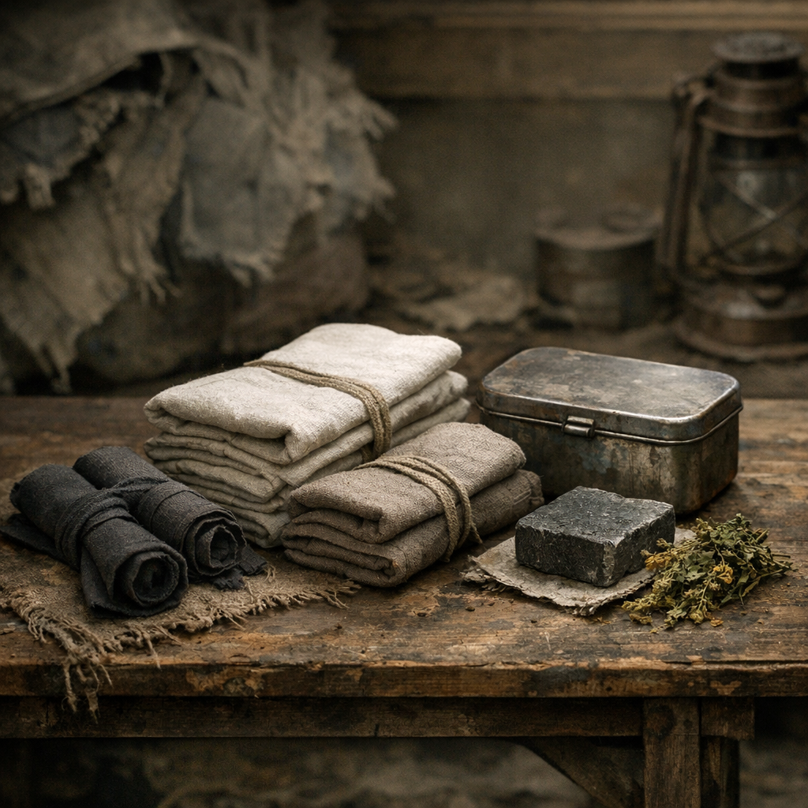

# Monatswickel-Kit

Menstruation verschwindet nicht, nur weil die Welt untergeht. Das Monatswickel-Kit ist die pragmatische Antwort der [Wasteland](../../Kanon/glossar.md#wasteland): waschbar, unromantisch, überlebenswichtig und oft von Frauen über Fraktionsgrenzen hinweg weitergegeben.

## Materialien & Herkunft

- weiche Stofflagen aus Hemden, Unterröcken, Kinderdecken oder sauber geschnittenen Resten
- Bindebänder aus Stoff, Drahtmantel ohne Kern oder geflochtener [Brennnessel](../Pflanzen/Brennnessel.md)-Faser
- ein kleiner Beutel oder Blechkasten für trockene und benutzte Wickel getrennt
- [Ascheseife](Ascheseife.md) und Wasser zum Auswaschen
- nach Möglichkeit etwas [Beifuss](../Pflanzen/Beifuss.md) oder [Weide](../Pflanzen/Weide.md) als Wärmewickel oder gegen Krämpfe

## Herstellung und Anwendung

Mehrere Stofflagen werden zu flachen Einlagen gefaltet oder grob vernäht. Wichtig ist nicht Schönheit, sondern dass sie sitzen, saugen und sich wieder auskochen lassen. Benutzte Wickel werden getrennt gesammelt, erst kalt ausgespült und später mit Seife gereinigt.

In guten Lagern gibt es dafür wenigstens etwas Privatsphäre. In schlechten Lagern organisieren Frauen sie sich gegenseitig. [Der Orden](../../Kanon/glossar.md#der-orden) behandelt Monatsblut nüchtern als Körperlogik. Hillbilly-Lager machen Witze, bis ihre besten Sammlerinnen ausfallen. [Retros](../../Kanon/glossar.md#retros) haben oft die saubersten Wickel, weil Nähen dort noch ernst genommen wird.

Das Kit ist kein Luxus. Es ist der Unterschied zwischen Beweglichkeit und tagelangem Rückzug.
