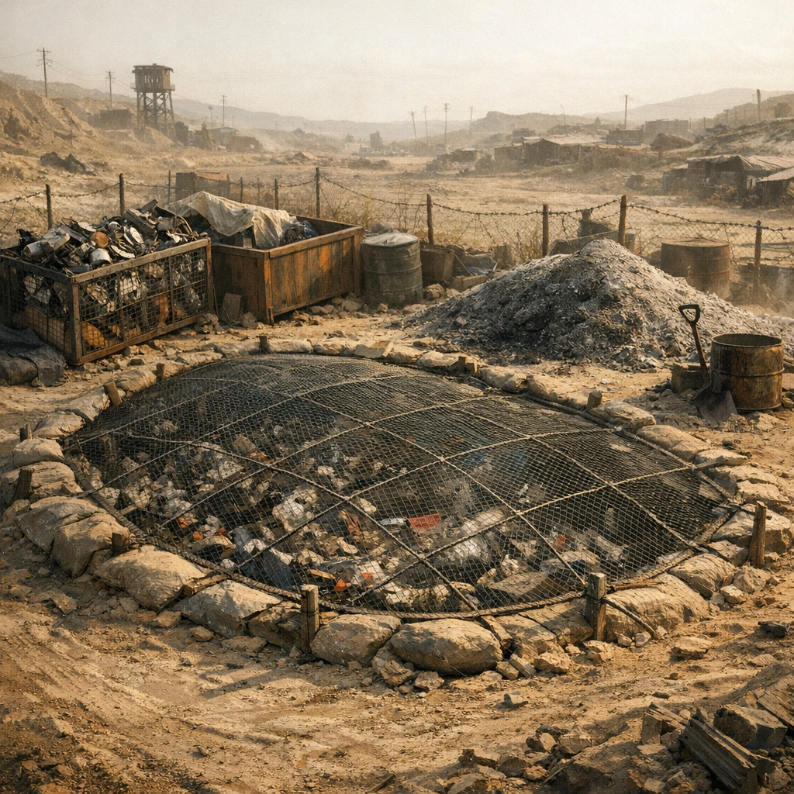

# Müllgrube mit Fliegendraht

Abfall ist Nahrung für Schaben, Ratten, Hunde und Seuchen. Eine kontrollierte Müllgrube hält das Lager nicht sauber, aber wenigstens etwas weniger lebendig an den falschen Stellen.

## Materialien & Herkunft

- eine tiefe Grube oder alter Containerrest
- Drahtgitter, Lochblech oder Maschenreste als Abdeckung
- Pfähle oder Steine zur Einfassung
- Asche, Erde und getrennte Sammelbehälter für Brennbares, Organisches und Metall
- ein Platz weit genug von Schlafstellen, Küche und Waschplatz

## Bau und Nutzung

Zuerst wird der Platz festgelegt, dann die Grube ausgehoben oder ein alter Behälter eingegraben. Darüber kommt Draht oder Lochblech, damit Tiere nicht sofort hineinkriechen und Müll wieder über den Platz verteilen. Organische Reste werden möglichst abgedeckt, Brennbares getrennt gesammelt und trocken gehalten.

Ordentliche Lager führen sogar feste Zeiten zum Entleeren und Verbrennen. In [Maker](../../Kanon/glossar.md#maker)-Siedlungen hängen oft kleine Schilder für Sortierung. [Hillbillys](../../Kanon/glossar.md#hillbillys) werfen erst alles zusammen und bauen Ordnung nach dem ersten Rattenjahr.

Die Müllgrube ist hässlich, stinkt und zieht trotzdem Leben an. Aber ohne sie wird das ganze Lager zur Müllgrube.
