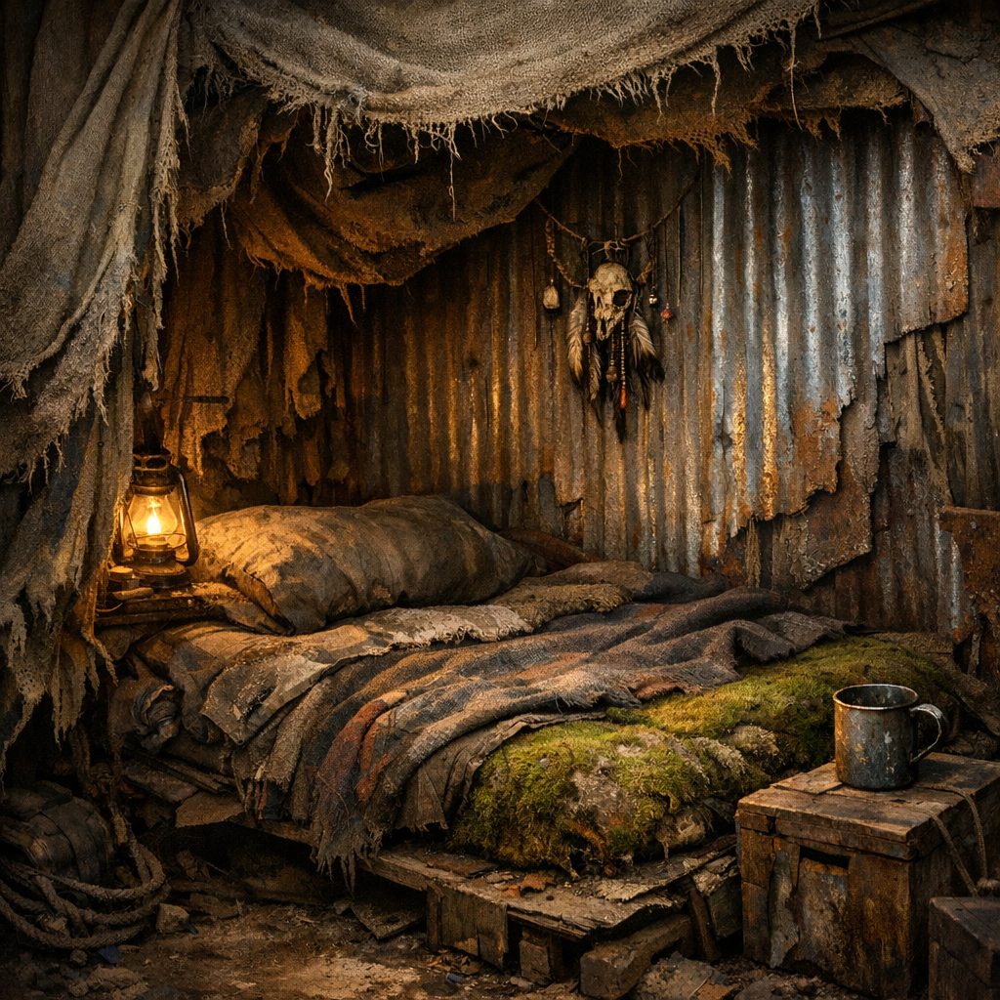

# Schlafnische

Die Schlafnische ist das Minimum eines privaten Ortes: ein Streifen Trockenheit, Windbruch, wenig Licht und genug Abstand, dass die Nacht nicht direkt im Gesicht anderer endet.

## Materialien & Herkunft

- Decken, Planen, Säcke oder zusammengenähte Stoffreste
- Strohersatz, trockene [Moose und Flechten](../Pflanzen/Moose-und-Flechten.md) oder Laub als Unterlage
- Schrottblech, Bretter oder Kistenwände gegen Zugluft
- Schnur, Draht oder gebogene Stangen zum Abhängen
- wenn vorhanden eine Wärmflasche, Steinwärme oder Zugang zur [Wärmegrube](Waermegrube.md)

## Bau und Nutzung

Zuerst wird der Boden trocken gemacht oder vom direkten Dreck entkoppelt. Darauf kommt eine dicke Lage aus Pflanzenmaterial oder Stoff, damit Körperwärme nicht in den Boden zieht. Seitlich schützen Planen oder Bleche gegen Wind, Staub und die Blicke anderer.

Gute Schlafnischen hängen persönliche Dinge über Kopfhöhe: Trinkbecher, Messer, Funkerinnerungen, kleine Talismane. In Ordenslagern sind sie fast klösterlich karg. Bei [Retros](../../Kanon/glossar.md#retros) riechen sie nach Rinde, Rauch und nassem Stoff. [Zeros](../../Kanon/glossar.md#zeros) nennen ähnliche Räume nicht so, aber selbst ihre Dienstleute schlafen am Ende in nur besserem Material.

Eine gute Nische ist nicht gemütlich. Sie ist trocken, still und überlebt die Nacht.
