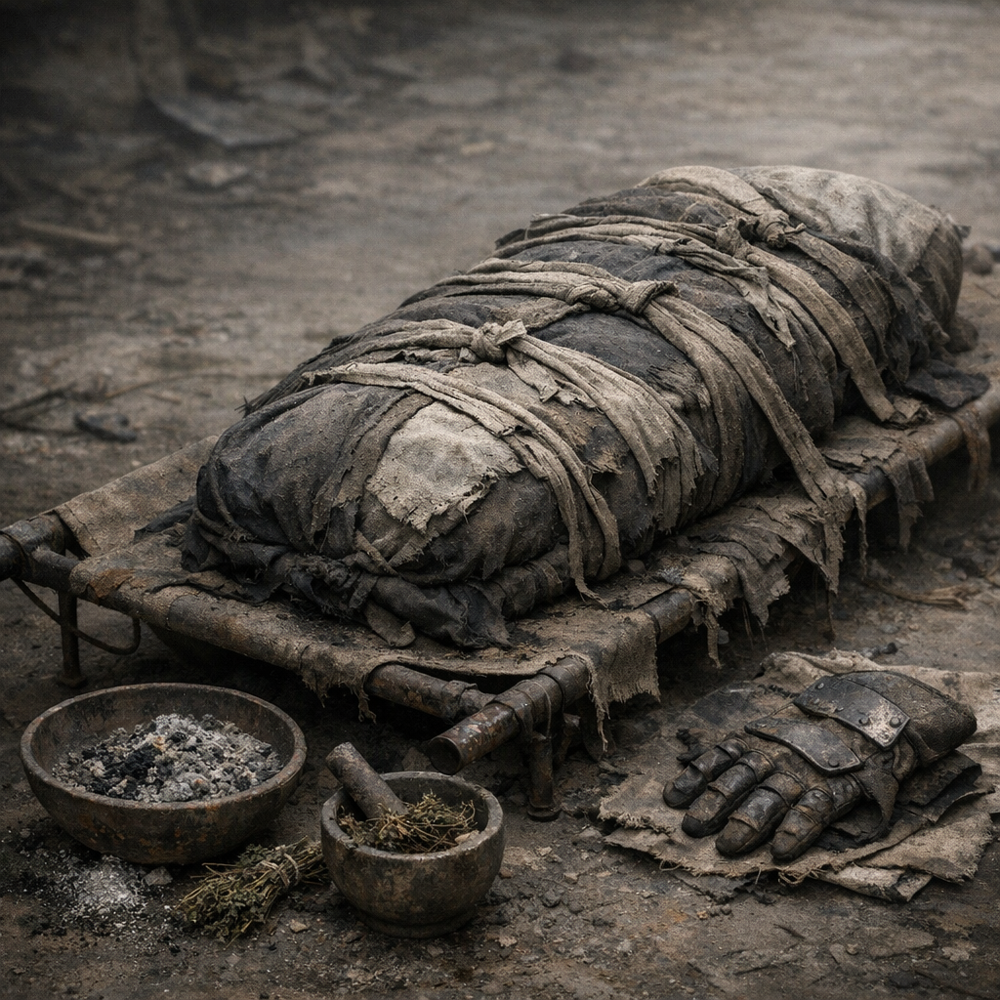

# Totenhülle Nullfaser

Ein Leichentuch, eine Bergungshülle und manchmal der letzte Rest Respekt. Die Totenhülle dient nicht nur dem Abschied, sondern schützt Lebende vor Flüssigkeiten, Geruch, Insekten und der entwürdigenden Improvisation offener Körper.

## Materialien & Herkunft

- dichte Stoffbahnen, Planenreste oder mehrere zusammengenähte Lagen
- Bindebänder, Lederriemen oder Drahtschlaufen
- etwas Asche, trockene Erde oder Kräuter wie [Beifuss](../Pflanzen/Beifuss.md) gegen Geruch
- Handschutz, Tücher oder improvisorische [Kellerfieber-Filterhaube](../Medizin/Kellerfieber-Filterhaube.md) für die Bergenden
- bei besseren Varianten eine Innenlage aus saugfähigem Stoff oder Flechtmatte

## Bau und Nutzung

Die Hülle wird flach vorbereitet und so gelegt, dass ein Körper mit möglichst wenig zusätzlichem Kontakt aufgenommen werden kann. Danach wird sie eng, aber nicht brutal verschnürt. Flüssigkeiten und Geruch werden mit Stoff, Erde oder Kräutern gebunden, bis Bestattung, Verbrennung oder Übergabe möglich sind.

[Der Orden](../../Kanon/glossar.md#der-orden) nutzt schlichte, markierte Hüllen. [Zeros](../../Kanon/glossar.md#zeros) haben sauberere Varianten für eigene Leute und grobe für den Rest. In freien Lagern näht meist irgendwer, der schon zu viele Tote gesehen hat.

Die Totenhülle ist kein Pathosobjekt. Sie ist ein Werkzeug gegen Würdelosigkeit.
