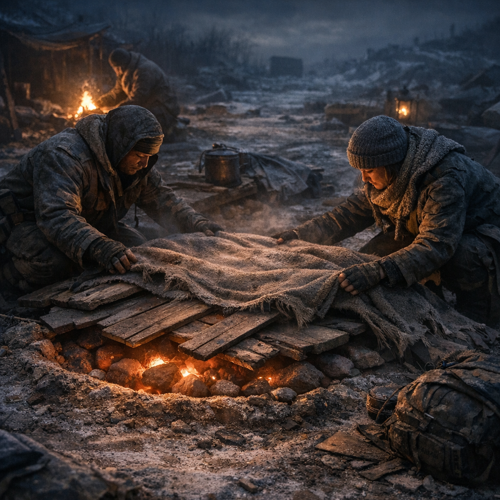

# Wärmegrube

Die billigste Heizung der Welt: Erde, Stein, Glut und Zeit. Wärmegruben retten Nächte in kalten Ruinen, halten Kranke stabiler und geben Kindern wenigstens für ein paar Stunden nicht das Gefühl, auf Eis zu schlafen.

## Materialien & Herkunft

- eine flache Grube oder gemauerte Bodenmulde
- Steine, Ziegel oder Metallplatten zum Wärmespeichern
- Feuerholz, Pressbrennstoff oder anderer sauber genug brennender Abfall
- Erde, Sand oder Asche zum Abdecken
- Decken, Bretter oder Schlafauflagen über der fertigen Wärmefläche

## Bau und Nutzung

Zuerst wird die Mulde mit Steinen oder Metall ausgelegt. Darin brennt für einige Stunden ein Feuer, bis der Untergrund tief warm ist. Danach werden Glutreste entfernt oder sicher verteilt, und die Fläche wird mit Erde, Asche oder Blech abgeschirmt.

Darüber kommen Schlafzeug, Trageflächen oder Wickelplätze. Die Wärme steigt langsam hoch und hält oft länger als offenes Feuer, ohne die ganze Nacht Licht und Rauch zu machen. Genau deshalb mögen Karawanen, Ordenspilger und Eltern kleiner Kinder diese Bauweise.

[Maker](../../Kanon/glossar.md#maker) bauen manchmal Lüftungsbleche dazu. [Hillbillys](../../Kanon/glossar.md#hillbillys) schätzen eher die rohe Version. Wer sie schlecht vorbereitet, schläft auf Rauch oder fängt Feuer. Wer sie gut macht, schläft zum ersten Mal seit Tagen nicht zitternd.
