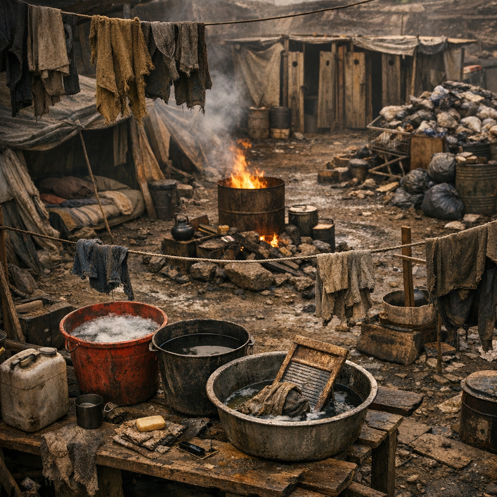

# Alltag & Hygiene

Alltag in der [Wasteland](../../Kanon/glossar.md#wasteland) heißt: schlafen, scheißen, waschen, flicken, wärmen, verstecken und irgendwie sauber genug bleiben, dass aus Elend nicht sofort Krankheit wird. Hygiene ist selten Komfort. Sie ist Schadensbegrenzung mit Eimern, Asche, Stoffresten, Draht und Disziplin.

Morgens beginnt der Alltag selten mit Bequemlichkeit. In maker-nahen Räumen wecken oft improvisierte [Lichtwecker](Lichtwecker.md): kleine Sonnenmechaniken aus Spiegelblech, Glas, Draht und Wärme. [Hillbillys](../../Kanon/glossar.md#hillbillys) werden dagegen natürlich wach, während im [Orden](../../Kanon/glossar.md#orden) Ranghöhere die Niedrigeren wecken.

## Einträge

- [Ascheseife](Ascheseife.md) – Waschmasse aus Lauge, Fett und Geduld gegen Dreck, Fettfilm und Lagergeruch.
- [Drei-Eimer-Waschplatz](Drei-Eimer-Waschplatz.md) – einfache Waschlogik für Lager, Karawanen und improvisierte Siedlungen.
- [Latrinenrigg](Latrinenrigg.md) – Gruben- und Sichtschutzbau gegen Gestank, Fliegen und Seuchenchaos.
- [Schlafnische](Schlafnische.md) – persönlicher Ruheplatz aus Stoff, Blech, Abstand und einem Rest Würde.
- [Lichtwecker](Lichtwecker.md) – improvisierte Sonnenwecker aus Reflexion, Wärme und Maker-Eigensinn.
- [Wärmegrube](Waermegrube.md) – gespeicherte Nachtwärme für Schlaf, Kranke und kleine Kinder.
- [Monatswickel-Kit](Monatswickel-Kit.md) – waschbarer Menstruationsersatz aus Stoff, Faser und diskreter Lagerlogik.
- [Kinderversteck](Kinderversteck.md) – stiller Schutzraum für Kinder bei Überfällen, Schüssen und Lagerpanik.
- [Müllgrube mit Fliegendraht](Muellgrube-mit-Fliegendraht.md) – Abfallplatz gegen Fraßtiere, Insektenwolken und krankes Lagerwasser.
- [Totenhülle Nullfaser](Totenhuelle-Nullfaser.md) – Leichentuch und Bergungshülle für sauberen Abschied unter schlechten Bedingungen.
- [Lauskamm Schrottzahn](Lauskamm-Schrottzahn.md) – einfache Kopf- und Fellpflege gegen Läuse, Nissen und juckende Lagerköpfe.
