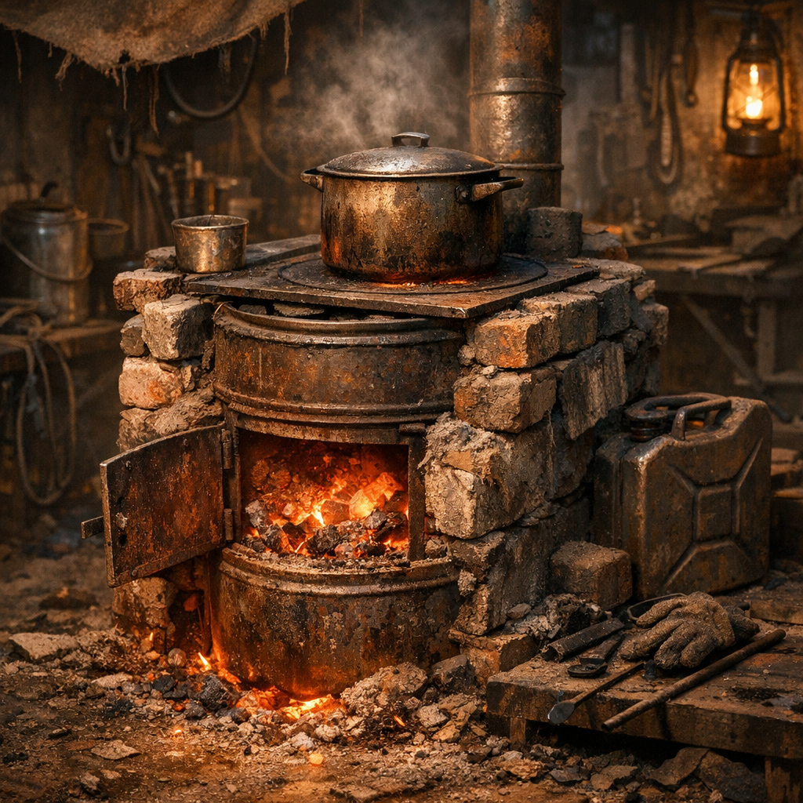

# Ascheofen

Der Ascheofen ist die unspektakuläre Maschine hinter vielen anderen Arbeiten. Er liefert konstante Hitze für Kochen, Trocknen, Seife, Metallvorwärme und jene langen kleinen Prozesse, die offenes Feuer nur schlecht beherrscht.

## Materialien & Herkunft

- gemauerte Brennkammer, Trommelrest oder Blechofen mit Zugloch
- Steine, Ziegel, Lehm oder Schrottblech zum Einfassen
- Holz, Brikettreste oder anderer kontrollierbarer Brennstoff
- Rost, Topfauflage oder eingeschobene Blechebenen
- Ascheschaufel, Haken und ein sicherer Standplatz

## Aufbau und Nutzung

Ein guter Ascheofen hält Glut länger als eine offene Feuerstelle und verschwendet weniger Brennstoff. Die Hitze kann oben, seitlich oder in Restglut genutzt werden. Genau deshalb steht er oft zwischen Küche, Werkplatz und Trockenbereich.

[Maker](../../Kanon/glossar.md#maker) bauen technischere Versionen mit Zugregelung. [Hillbillys](../../Kanon/glossar.md#hillbillys) setzen auf dicke, rußige Monster aus Fässern. [Retros](../../Kanon/glossar.md#retros) bevorzugen gemauerte Varianten, die sich reparieren lassen. Alle mögen ihn, wenn der Wind kalt wird und Arbeit trotzdem weitergehen muss.
