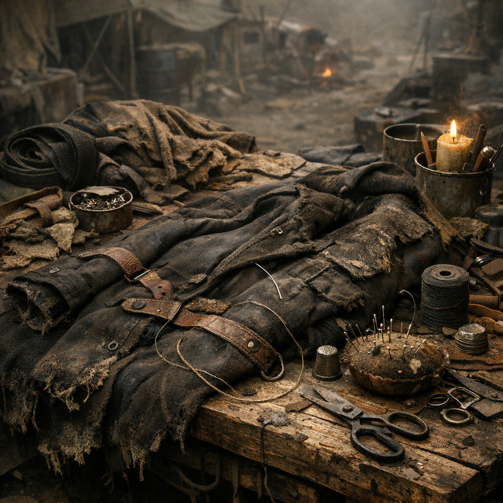

# Flickbank

Die Flickbank ist einer der wichtigsten Arbeitsplätze jeder halbwegs stabilen Siedlung. Hier werden Rucksäcke wieder tragbar, Mäntel wieder winddicht und Gurte wieder belastbar. Ohne Flickbank frisst die [Wasteland](../../Kanon/glossar.md#wasteland) jedes Stück Stoff schneller, als man es bergen kann.

## Materialien & Herkunft

- ein Tisch, Brett auf Böcken oder eine feste Kistenreihe
- Nadeln aus Altbestand oder von der [Knochenwerkbank](Knochenwerkbank.md)
- Faden, Draht, Pflanzenfaser oder gedrehte Stoffstreifen
- Lederreste, Planenstücke, alte Jacken, Gurtband und Knöpfe aus Bergung oder Tausch
- gute Schere, Messer oder Blechschneider

## Aufbau und Nutzung

Die Flickbank wird trocken, hell und möglichst windgeschützt aufgebaut. Kleine Dinge verschwinden sonst im Staub oder in den Ritzen. Auf ihr liegen Reparaturstapel: Kleidung, Tragzeug, Filterhauben, Kinderdecken, Riemen, Satteltaschen und manchmal sogar Funktaschen.

[Retros](../../Kanon/glossar.md#retros) arbeiten hier ruhig und sauber. [Maker](../../Kanon/glossar.md#maker) verstärken alles gleich mit zusätzlichen Nieten und Halteschlaufen. In Hillbilly-Lagern wird eher so geflickt, dass es bis zum nächsten Streit hält. Gute Flickerinnen sind überall begehrt, weil sie aus fast kaputt wieder brauchbar machen.
