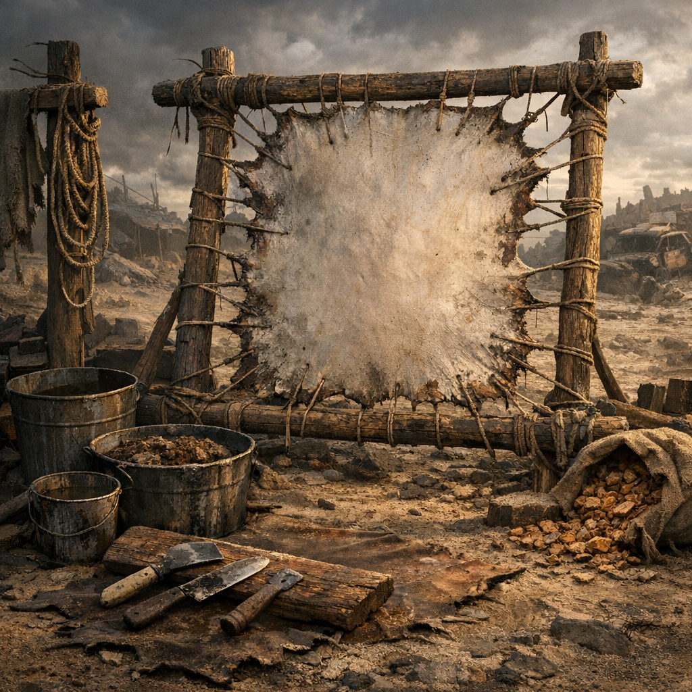

# Gerberahmen

Wer Leder will, muss zuerst Gestank, Geduld und Hände investieren. Der Gerberahmen ist die Station, an der rohe Haut zu Riemen, Taschen, Schutzlappen oder Stiefelflicken wird.

## Materialien & Herkunft

- Holzrahmen, Metallrahmen oder gespannte Stangen
- Tierhäute von [Rotzschweinen](../Tiere/Rotzschweine.md), Hunden oder anderer Jagdbeute
- Messer, Schaber, Asche, Salzreste oder Gerbbrühe
- Schnüre, Haken oder Klammern zum Spannen
- schattiger Platz mit Luftzug, aber nicht mitten im Lager

## Aufbau und Nutzung

Zuerst werden Fett, Fleischreste und Dreck von der Haut gezogen. Danach wird sie gewaschen, in Asche oder Brühe vorbereitet und straff auf den Rahmen gespannt. Dort trocknet und arbeitet sie sich langsam zu etwas Brauchbarem um, wenn man sie regelmäßig nachspannt und schabt.

[Hillbillys](../../Kanon/glossar.md#hillbillys) verarbeiten fast alles vom Tier. [Retros](../../Kanon/glossar.md#retros) machen oft die saubersten Lederstücke. [Maker](../../Kanon/glossar.md#maker) kaufen das Ergebnis lieber, als selbst im Gerbgestank zu stehen. Ein guter Gerberahmen liefert Material für Monate, wenn niemand es vorher stiehlt.
