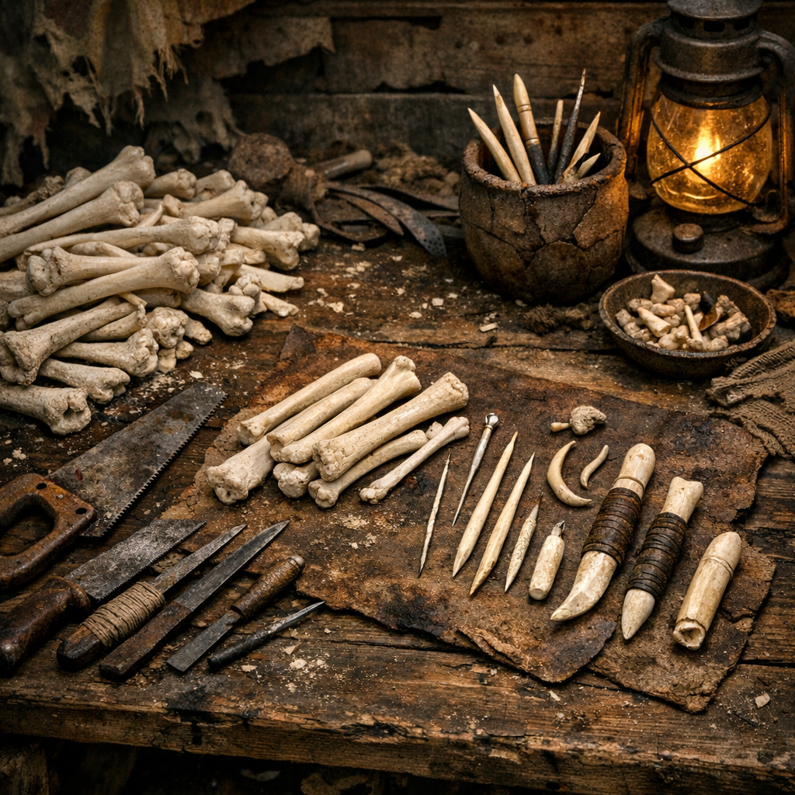

# Knochenwerkbank

Wenn Metall knapp ist, werden Knochen plötzlich wieder ernst genommen. Auf der Knochenwerkbank entstehen Nadeln, Haken, Knöpfe, Kammzinken, Griffe und andere Kleinteile, die sonst niemand vermissen würde, bis sie fehlen.

## Materialien & Herkunft

- lange, harte Knochen aus Jagd, Schlachtabfall oder Aasbergung
- Säge, Messer, Feile und Schleifstein
- Bohrer, Dorn oder erhitzte Metallspitze
- Öl, Talg oder Fett zum Glätten
- Schalen für fertige Kleinteile und Späne

## Aufbau und Nutzung

Knochen werden erst gereinigt, ausgekocht oder ausgeschabt, dann in Rohlinge geschnitten. Danach folgen Schleifen, Bohren und Glätten. Gerade [Retros](../../Kanon/glossar.md#retros) und arme Lager lieben diese Werkbank, weil sie aus Resten Dinge macht, die sonst überraschend schwer zu bekommen sind.

In manchen Siedlungen ist sie unscheinbar. In Hillbilly-Gebieten wirkt sie wie Trophäenbau. Das Ergebnis bleibt trotzdem praktisch: fein, leicht, zäh und gut genug für hundert kleine Alltagsprobleme.
