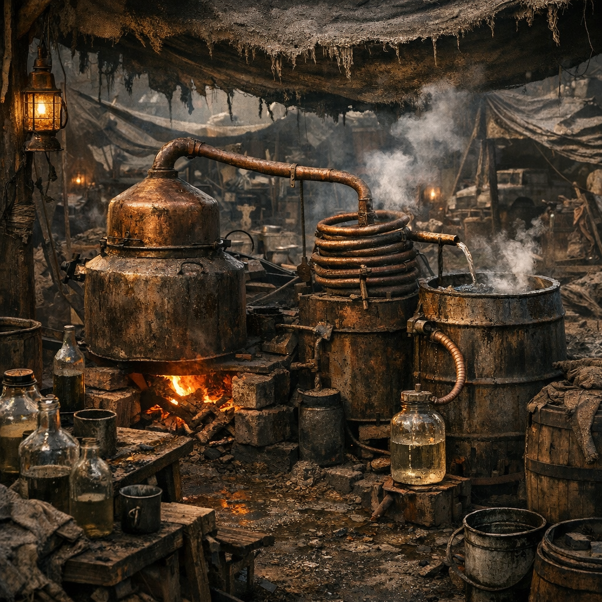

# Moonshine-Brennplatz

[Hillbillys](../../Kanon/glossar.md#hillbillys) bauen aus fast allem eine Brennerei. Der Moonshine-Brennplatz ist Küche, Chemielabor, Waffenwerkstatt und Handelsmaschine zugleich. Was dort läuft, kann wärmen, betäuben, reinigen, explodieren oder blind machen.

## Materialien & Herkunft

- Fässer, Töpfe, Schlangenrohre und Kondensgefäße aus Schrott oder Tausch
- Maisersatz, Zuckerreste, vergorene Beeren oder alter Dosenmatsch
- Feuerstelle oder [Ascheofen](Ascheofen.md) für gleichmäßige Hitze
- Kanister, Flaschen oder Blechbehälter zum Lagern
- Lappen, Holzkohle und improvisierte Filter gegen den gröbsten Dreck

## Aufbau und Nutzung

Ein Brennplatz braucht Abstand zum Schlaflager und trotzdem Schutz vor Dieben. Zuerst gärt die Brühe in Tonnen oder Tanks, danach wird sie über ruhiger Hitze gekocht und durch Rohre wieder abgekühlt. Gute [Hillbillys](../../Kanon/glossar.md#hillbillys) riechen schon beim ersten Tropfen, ob die Charge verkaufbar, medizinisch brauchbar oder nur noch für Generatoren gut ist.

Moonshine geht in der [Wasteland](../../Kanon/glossar.md#wasteland) nie nur ins Glas. Er wird getauscht, als Wundspülung benutzt, mit Kräutern versetzt oder in Flaschen als Brandwaffe gedacht. Deshalb wird ein guter Brennplatz fast so stark bewacht wie ein Waffenlager.
