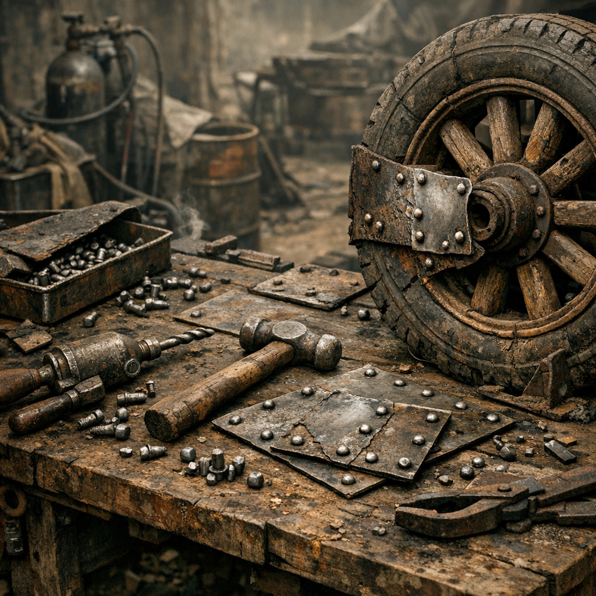

# Nietenstand

Der Nietenstand ist die schnellste Art, kaputtes Metall wieder zusammenzuzwingen, wenn Schweißen zu aufwendig oder Strom zu knapp ist. Hier werden Karren geflickt, Rüstbleche gehalten und Türen widerwillig noch eine Saison im Rahmen gelassen.

## Materialien & Herkunft

- Handbohrer, Dorn oder Durchschlag
- Niethammer und Ambossersatz
- Nieten, Schraubenreste oder zurechtgeschnittene Drahtstifte
- Bleche, Schienen, Halterungen und Metallflicken
- eine feste Unterlage und genug Licht für Loch auf Loch

## Aufbau und Nutzung

Zuerst werden Bruchstellen geglättet und überlappend angelegt. Danach kommen Löcher, Nieten und Schläge, bis aus zwei schwachen Teilen wieder ein etwas stärkeres schwaches Teil wird. Gute Nietenstände haben Sortierschalen für Größen und ein kleines Maß von Präzision. Schlechte produzieren nur scharfe Kanten und Flüche.

Karawanenleute lieben sie, weil sie unterwegs funktionieren. [Maker](../../Kanon/glossar.md#maker) machen hier grobe Vorarbeiten, bevor etwas später sauberer in die Schmiede geht. Für viele Lager ist der Nietenstand die eigentliche Industrie.
