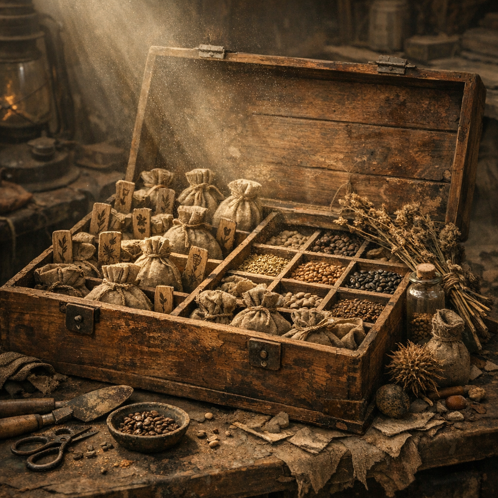

# Saatgutkiste

Für die [Retros](../../Kanon/glossar.md#retros) ist Saatgut keine Ware wie jede andere. Es ist eingefaltete Zukunft. Eine gute Saatgutkiste bewahrt Trockenheit, Ordnung und Herkunft, damit aus einer Saison nicht nur Hungerverwaltung wird.

## Materialien & Herkunft

- dichte Kiste aus Holz, Blech oder Keramik mit Deckel
- kleine Beutel, Tütchen, Röhrchen oder Fächer
- trockenes Saatgut aus Tausch, eigener Ernte oder [Low-Tech-Basar](../../Orte/Handelsposten/Low-Tech-Basar.md)
- Asche, trockene Kräuter oder Stofflagen gegen Feuchte und Schädlinge
- Markierungen für Sorte, Alter und Herkunft

## Aufbau und Nutzung

Samen werden nur vollständig trocken eingelagert. Danach kommen sie in getrennte Beutel oder Fächer, damit Misserfolg nicht gleich alles vernichtet. Gute Kisten lagern dunkel, kühl und nicht direkt am Boden. Noch bessere werden regelmäßig überprüft und neu beschriftet.

[Retros](../../Kanon/glossar.md#retros) behandeln sie beinahe ehrfürchtig. [Zeros](../../Kanon/glossar.md#zeros) kaufen gute Sorten, ohne zu begreifen, warum andere dafür kämpfen würden. Für hungernde Lager ist eine intakte Saatgutkiste oft wertvoller als ein einzelner Sack Dosenfraß.
