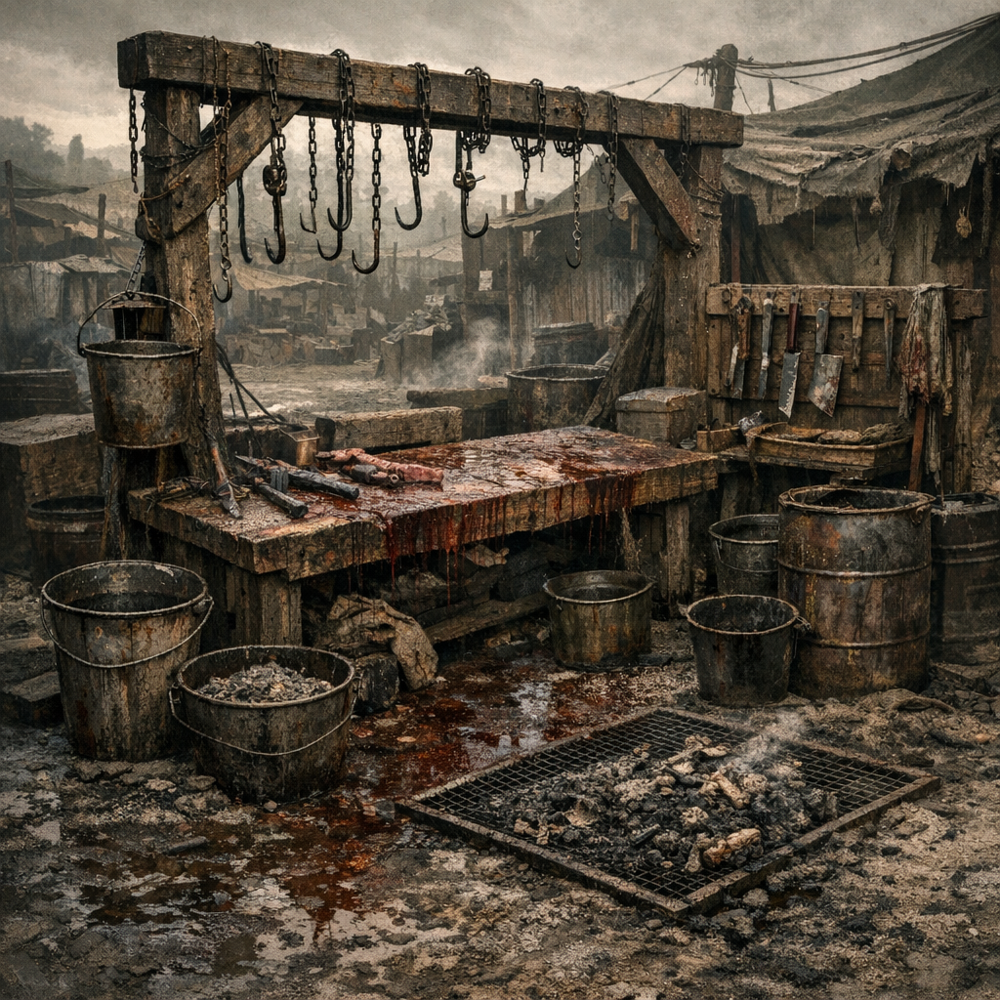

# Schlachtgrube

Eine Schlachtgrube ist der Ort, an dem aus Beute Versorgung wird. Sie hält Blut, Innereien und Reste aus den Schlafplätzen fern und trennt Arbeit von Chaos. In schlechten Lagern ist sie nur ein Loch. In guten Lagern ist sie Hygiene.

## Materialien & Herkunft

- eine tiefe, gut abfließende Grube oder eingefasste Arbeitsmulde
- Haken, Ketten, Seile oder Schlachtstangen
- Messer, Beile, Schaber und Sammelbehälter
- Wasser, [Ascheseife](../Alltag/Ascheseife.md) und Asche für grobe Reinigung
- etwas Abstand zu Küche, Kindern und Trinkwasser

## Aufbau und Nutzung

Tiere oder Kadaver werden am Rand aufgehängt oder auf Brettern zerlegt, damit Fleisch, Haut, Knochen und Abfall getrennt bleiben. Verwertbares geht weiter zur Küche, zum [Gerberahmen](Gerberahmen.md) oder zur [Knochenwerkbank](Knochenwerkbank.md). Der Rest wird verbrannt, vergraben oder als Köder weit weg vom Lager genutzt.

[Hillbillys](../../Kanon/glossar.md#hillbillys) nennen das Ehre. [Maker](../../Kanon/glossar.md#maker) nennen es Materialfluss. Alle anderen nennen es nur dann barbarisch, wenn sie satt sind.
