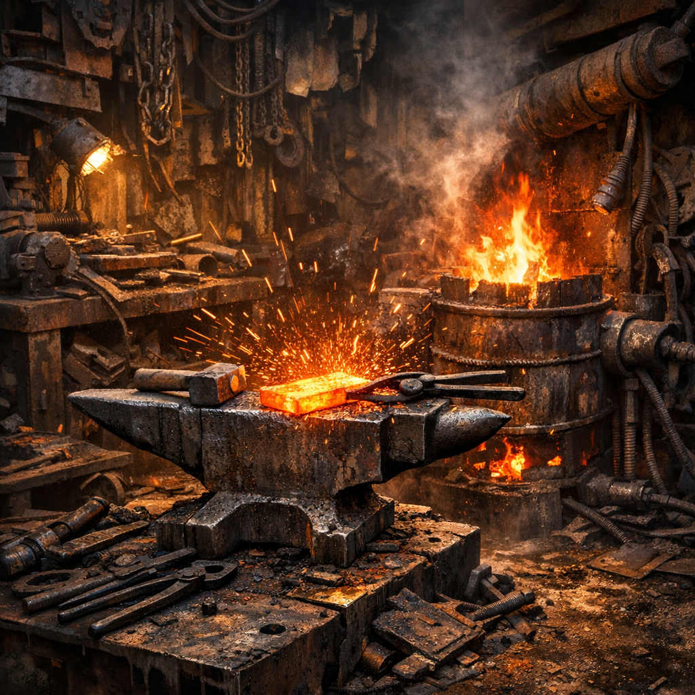

# Schrotthärte-Schmiede

[Maker](../../Kanon/glossar.md#maker)-Schmieden sind keine romantischen Feuerstätten. Sie sind laute, heiße Präzisionshöhlen aus Amboss, Funken und Wut. Hier wird Altmetall in neues Überleben gezwungen.

## Materialien & Herkunft

- Esse, Blasebalg oder Gebläse aus Alttechnik
- Ambossersatz, Schienenstück oder schwerer Stahlblock
- Zangen, Hämmer, Feilen und Abschreckwanne
- Schrottmetall, Federstahl, Bolzen, Kettenreste oder Werkzeugbruch
- Kohle, Koksersatz oder heiß genug brennender Industrieabfall

## Aufbau und Nutzung

Zuerst wird Metall nach Härte und Verwendungszweck getrennt. Dann folgen Hitze, Form, Schlag und Abschrecken. In einer guten Schrotthärte-Schmiede entstehen Messer, Halterungen, Haken, Wagenbeschläge, Scharniere, Schutzplatten und manchmal überraschend feine Werkzeuge.

[Steampunks](../../Kanon/glossar.md#steampunks) arbeiten hier mit beinahe religiösem Stolz. [Retros](../../Kanon/glossar.md#retros) respektieren die Schmiede, misstrauen aber elektrischen Gebläsen. Für Karawanen ist sie Gold wert, weil jede reparierte Achse und jede neue Klammer eine Fahrt mehr bedeuten kann.
