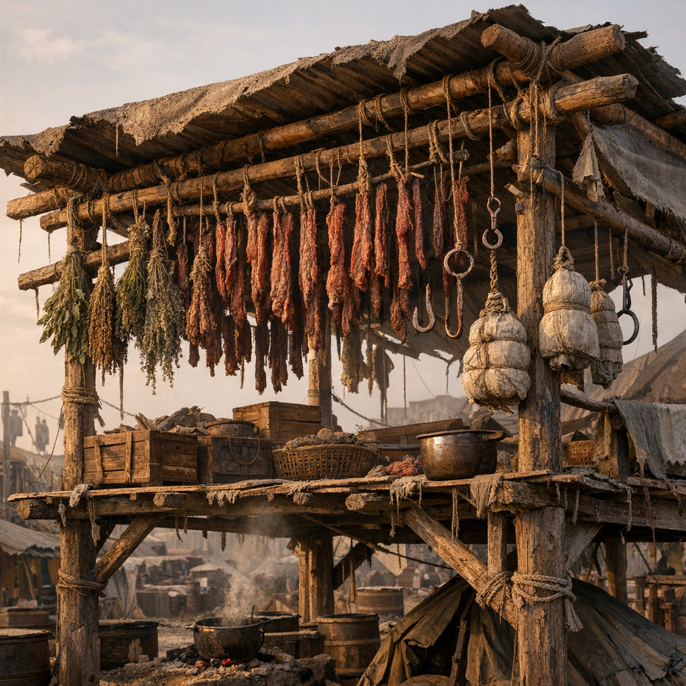

# Trockengestell

Das Trockengestell ist stilles Rückgrat jeder dauerhaften Siedlung. Was hier hängt, fault langsamer, hält länger und wird transportierbar. Fleisch, Kräuter, Stoffwickel und Pilzzeug bekommen über dem Boden überhaupt erst eine Chance.

## Materialien & Herkunft

- Stangen, Draht, Haken oder gespannte Schnüre
- Dachrest, Plane oder Rauchschutz gegen Regen
- Fleischstreifen, [Beifuss](../Pflanzen/Beifuss.md), [Wilder Hopfen](../Pflanzen/Wilder-Hopfen.md), Wickelstoff oder andere trocknungsfähige Dinge
- ein luftiger Platz oder schwacher Rauchzug
- Abdeckungen gegen Hunde, Ratten und Vögel

## Aufbau und Nutzung

Das Gestell wird erhöht gebaut, damit Dreck und Tiere nicht direkt drankommen. In trockenen Zonen reicht Luftzug, in feuchten Regionen hilft Rauch. Gute Lager trennen Lebensmittel, Heilzeug und Stoffe voneinander, damit nichts den Geruch oder Schmutz des anderen zieht.

Gerade deshalb steht ein Trockengestell oft nah bei Küche, Medizin oder Gerberei. Es ist kein spektakulärer Ort. Aber ohne ihn gammelt die halbe Arbeit weg.
