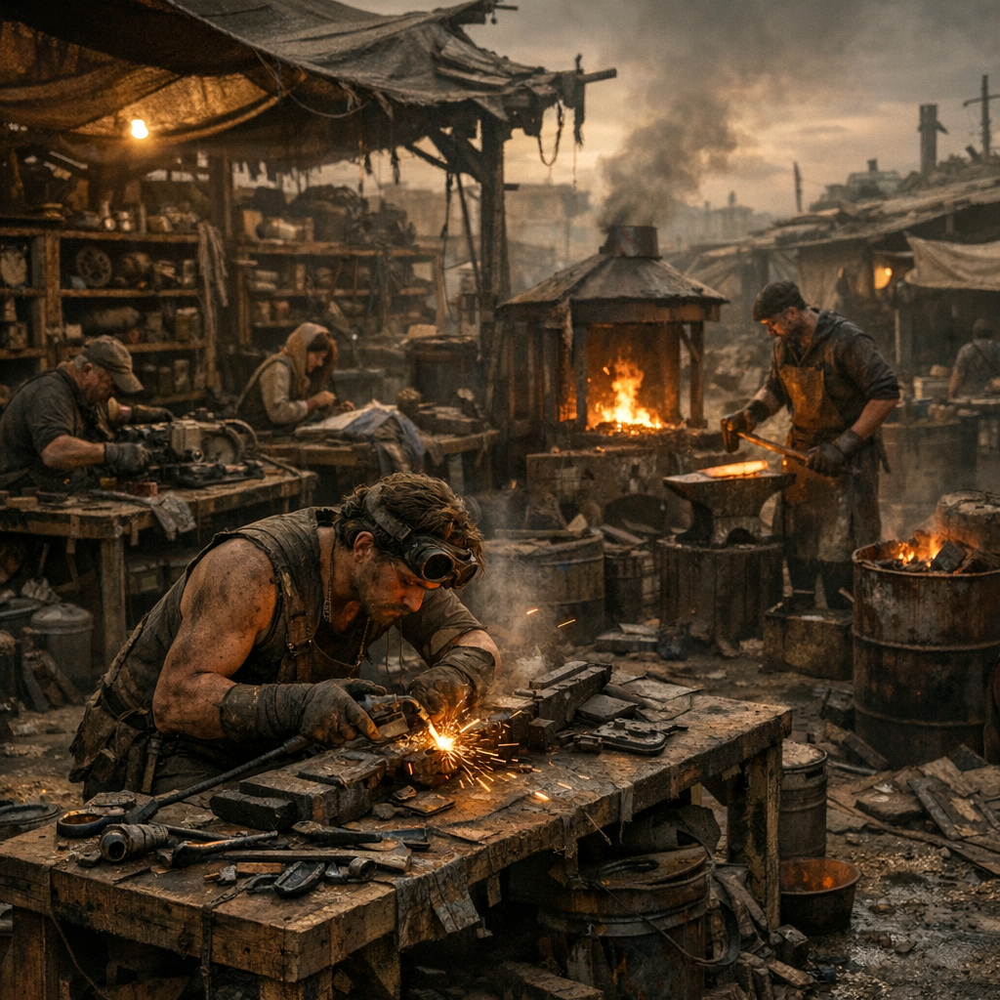

# Arbeit & Handwerk

Arbeit in der [Wasteland](../../Kanon/glossar.md#wasteland) ist selten Beruf und fast immer Überlebensfunktion. Geschlachtet, geflickt, gegerbt, gebrannt, getrocknet, genietet und improvisiert wird überall dort, wo Menschen länger bleiben wollen. Handwerk ist Status, Schutz, Tauschwert und manchmal die letzte Grenze zwischen Lager und Zusammenbruch.

## Einträge

- [Flickbank](Flickbank.md) – Näh-, Reparatur- und Impro-Arbeitsplatz für Kleidung, Gurte, Planen und Tragezeug.
- [Moonshine-Brennplatz](Moonshine-Brennplatz.md) – Hillbilly-Brennerei für Schnaps, Tauschware, Treibstoff und schlechte Ideen.
- [Schrotthärte-Schmiede](Schrotthaerte-Schmiede.md) – [Maker](../../Kanon/glossar.md#maker)-Schmiedeecke für Werkzeuge, Klingen, Halterungen und Metallflickwerk.
- [Gerberahmen](Gerberahmen.md) – Rahmenplatz zum Spannen, Trocknen und Gerben von Haut und Leder.
- [Trockengestell](Trockengestell.md) – Luft- und Rauchplatz für Kräuter, Fleisch, Wickelstoff und Pilzzeug.
- [Schlachtgrube](Schlachtgrube.md) – zerlegbarer Arbeitsort für Rotzschwein, Hundekadaver und alles, was verwertet werden muss.
- [Nietenstand](Nietenstand.md) – schneller Reparaturplatz für Bleche, Karren, Rüstzeug und Lagerkram.
- [Knochenwerkbank](Knochenwerkbank.md) – Werkbank für Kämme, Haken, Nadeln, Griffe und andere harte Kleinteile.
- [Saatgutkiste](Saatgutkiste.md) – Retro-Aufbewahrung für trockenes Saatgut, Tauschgut und die Idee von Zukunft.
- [Ascheofen](Ascheofen.md) – einfacher Dauerofen für Glut, Trocknung, Kochhitze und Werkstattwärme.
