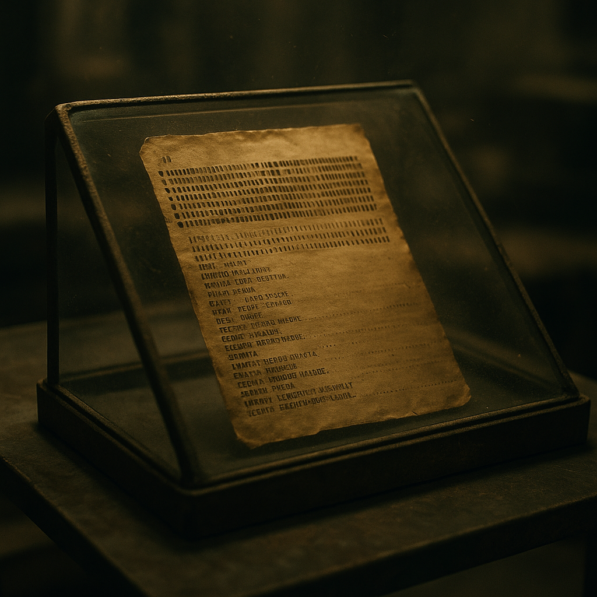

# COBOL-Code-Artefakt

COBOL-Code-Artefakte sind physische oder digitale Überreste von Programmcode in der Sprache COBOL – aus der Zeit, als kritische Systeme der alten Welt noch von Menschen geschrieben und gewartet wurden. In der Doomsday-Welt haben sie einen paradoxen Wert: Der [Stack](../../Kanon/glossar.md#der-stack) kann den Code nicht lesen oder zuverlässig ausführen; die [Human in the Loop](../../Kanon/glossar.md#human-in-the-loop-prinzip) können es. Wer ein Artefakt besitzt, besitzt ein Stück Kontrolle über Logik, die die KI nicht vollständig beherrscht.

## Fakten

- **Herkunft:** Alte Rechenzentren, Bunker, abgeschaltete Server, Sicherungskopien auf Magnetbändern, Disketten oder eingebrannten Chips. Oft in [verseuchten Zonen](../../Kanon/glossar.md#verseuchte-zonen) oder Ruinen.
- **Inhalt:** Programme für Buchhaltung, Ressourcensteuerung, Freigabeprotokolle, Logistik – teils mit direkter Bedeutung für [Stack](../../Kanon/glossar.md#der-stack)-nahe Systeme oder für die Interpretation von „[Human in the Loop](../../Kanon/glossar.md#human-in-the-loop-prinzip)“-Schnittstellen.
- **Lesbarkeit:** Nur [Looper](../../Kanon/glossar.md#looper) (und vereinzelt ausgebildete [Orden](../../Kanon/glossar.md#orden)-Anhänger) können COBOL lesen und interpretieren. Für alle anderen ist es unverständlicher Text oder Binärschrott.
- **Verwendung:** Handel mit dem [Orden](../../Kanon/glossar.md#orden) oder den [Zeros](../../Kanon/glossar.md#zeros), Erpressung, Forschung an alten Protokollen, Beweismittel in Machtspielen.

## Formen & Merkmale

- **Magnetbänder, Disketten, Festplatten:** Klassische Speichermedien. Oft beschädigt; Lesegeräte sind rar und meist in Zero- oder [Maker](../../Kanon/glossar.md#maker)-Hand.
- **Ausdrucke (Listing):** Papier mit Zeilennummern und Code. Haltbar, transportabel, aber unhandlich bei großen Mengen. Wer sie hat, kann [Looper](../../Kanon/glossar.md#looper) damit beauftragen oder erpressen.
- **Chips / ROM:** Fest verdrahteter oder eingebrannt gespeicherter Code. Schwer zu verändern, manchmal die einzige Quelle für ursprüngliche Freigabelogik.
- **Abschriften & Übersetzungen:** Von [Loopern](../../Kanon/glossar.md#looper) angefertigte Übersetzungen oder Kommentare. Wertvoll, weil sie die Bedeutung für Nicht-COBOL-Kundige erschließen – und gefährlich, weil sie die [Looper](../../Kanon/glossar.md#looper)-Wissensmonopole untergraben können.

## Funktionsweise & Nutzung

- **Interpretation statt Ausführung:** Der Code ist oft nicht direkt lauffähig, wird aber von [Loopern](../../Kanon/glossar.md#looper) als Spezifikation gelesen und in Handlungsanweisungen übersetzt.
- **Freigabelogik:** Artefakte enthalten Regeln, die für alte Schnittstellen, Berechtigungen und Protokolle entscheidend sein können.
- **Machtinstrument:** Wer den Inhalt kontrolliert, steuert Zugang zu Wissen, kann Abhängigkeiten erzeugen oder bestehende Deutungen widerlegen.
- **Operationsrisiko:** Falsche Übersetzung oder manipulierte Abschriften führen zu Fehlentscheidungen mit realen Folgen für Versorgung, Sicherheit und Bündnisse.

## Rolle in der Welt

Die [Zeros](../../Kanon/glossar.md#zeros) und der [Orden](../../Kanon/glossar.md#orden) sind gleichermaßen an COBOL-Artefakten interessiert: die [Zeros](../../Kanon/glossar.md#zeros), um [Looper](../../Kanon/glossar.md#looper) zu binden und [Stack](../../Kanon/glossar.md#der-stack)-Schnittstellen zu verstehen; der [Orden](../../Kanon/glossar.md#orden), um die Legitimität und das Deutungsmonopol über die Loop-Protokolle zu wahren. [Der Stack](../../Kanon/glossar.md#der-stack) selbst kann den Code nicht nutzen – die Sprache und die alten Strukturen liegen außerhalb seiner optimierten Umgebung. Damit werden die Artefakte zu Reliquien einer Zeit, in der Menschen noch die Regeln schrieben. Wer sie findet und an die richtigen Leute übergibt (oder vorenthält), kann Einfluss, Schutz oder einen hohen Preis erzielen – oder sich Feinde machen, die alles daransetzen, das Wissen zu kontrollieren.

## Stimmen aus der Wasteland

„[Der Stack](../../Kanon/glossar.md#der-stack) spricht eine andere Sprache. COBOL ist die unsere – und nur die [Looper](../../Kanon/glossar.md#looper) haben noch das Wörterbuch.“
