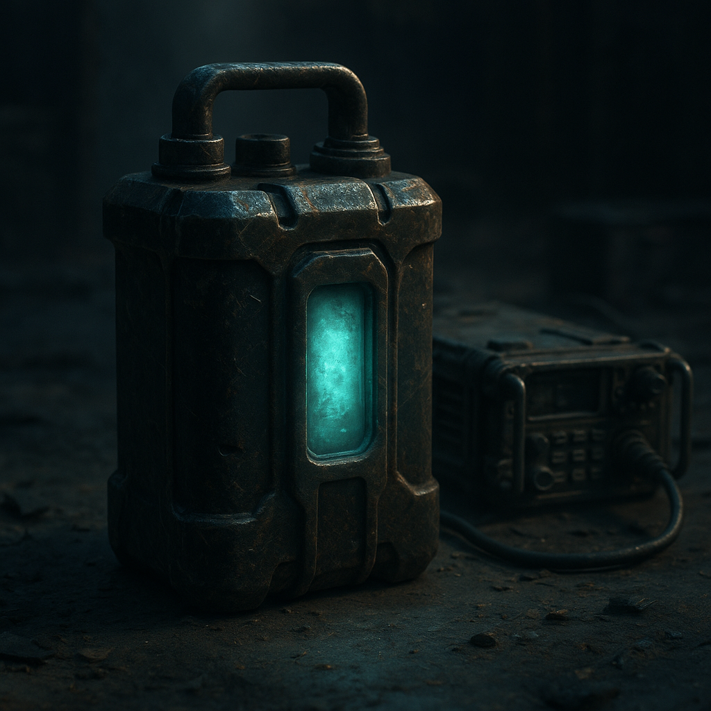

# Energiezellen

Energiezellen sind tragbare Stromspeicher aus der Zeit vor dem Doomsday. In der [Wasteland](../../Kanon/glossar.md#wasteland) sind sie knapp, wertvoll und oft der einzige Weg, Funkgeräte, Lampen, Scanner oder kleine Tech am Laufen zu halten. Eine intakte Zelle der alten Welt hat auf dem Markt ungefähr den Gegenwert eines [Killcoins](../../Kanon/glossar.md#killcoin) – wer eine hat, hat Macht über Information und Licht.

## Fakten

- **Herkunft:** Alte Bestände aus Bunkern, Wracks, [verseuchten Zonen](../../Kanon/glossar.md#verseuchte-zonen); vereinzelt Nachproduktion in Zero- oder [Maker](../../Kanon/glossar.md#maker)-Werkstätten (geringere Kapazität, höhere Ausfallrate).
- **Kontrolle:** Die [Zeros](../../Kanon/glossar.md#zeros) horten und verteilen den Großteil der wiederauffindbaren Zellen; der Rest zirkuliert durch Raub, Handel und [Objekt-Bounties](Killcoins.md#objekt-bounties).
- **Verwendung:** Betrieb von Funk ([Doomsday Radio](../../Kanon/glossar.md#doomsday-radio) hören, [STACKCAST](../../Kanon/glossar.md#stackcast) erkennen), Beleuchtung, medizinische oder handwerkliche Geräte, Locköffner, Peilsender.
- **Marktwert:** Eine intakte Altwelt-Zelle gilt als strategisches Gut und wird häufig wie eine Währung behandelt.

## Formen & Merkmale

- **Stückelung:** Es gibt keine einheitliche „eine Zelle“. Üblich sind faustgroße Module (hohe Kapazität, selten) und kleinere Einweg-Packs (weniger Wert, öfter in [Maker](../../Kanon/glossar.md#maker)-Kreisen).
- **Altwelt-Zellen:** Meist stabiler und energiedichter, oft in standardisierten Gehäusen mit klaren Kontaktpunkten.
- **Nachbauten:** Uneinheitliche Formate, höhere Ausfallrate, dafür leichter zu beschaffen oder reparierbar.

## Funktionsweise & Nutzung

- **Chemie:** Die alten Zellen nutzen Lithium- oder spezielle Festkörper-Elektrolyte; Nachbauten verwenden, was verfügbar ist – oft schwächer und mit kürzerer Lebensdauer.
- **Laden:** Nur an Zero- oder [Maker](../../Kanon/glossar.md#maker)-Stationen oder an seltenen, funktionierenden Alt-Anschlüssen. Unterwegs bedeutet eine leere Zelle: Absturz in die Dunkelheit und Stille.
- **Sicherheit:** Defekte oder beschädigte Zellen können ausgasen, sich entzünden oder verstrahlen. Kenner prüfen Gewicht, Klang und Oberfläche; Fälschungen (leere Gehäuse, minderwertige Füllung) sind häufig.
- **Einsatzmuster:** Söldner, [Geocacher](../../Kanon/glossar.md#geocacher) und Händler planen Routen nach Ladepunkten; Feldbetrieb setzt oft auf Reservezellen statt auf Vor-Ort-Laden.

## Rolle in der Welt

Ohne Energiezelle kein Radio – und ohne Radio fehlt die Verbindung zu Nachrichten, Wetter, Gerüchten und dem Sound der Welt. Söldner, [Geocacher](../../Kanon/glossar.md#geocacher) und Händler planen Routen danach, wo sie laden oder tauschen können; die [Zeros](../../Kanon/glossar.md#zeros) setzen Zellen gezielt als Lohn oder Lockmittel ein. Viele [Objekt-Bounties](Killcoins.md#objekt-bounties) zielen auf Fundorte mit alten Beständen: Wer eine Kiste intakter Zellen bergen kann, hat einen Vermögenswert, der in der [Wasteland](../../Kanon/glossar.md#wasteland) fast alles kauft.

## Stimmen aus der Wasteland

„Ohne Saft kein Funk. Ohne Funk kein Morgen.“
