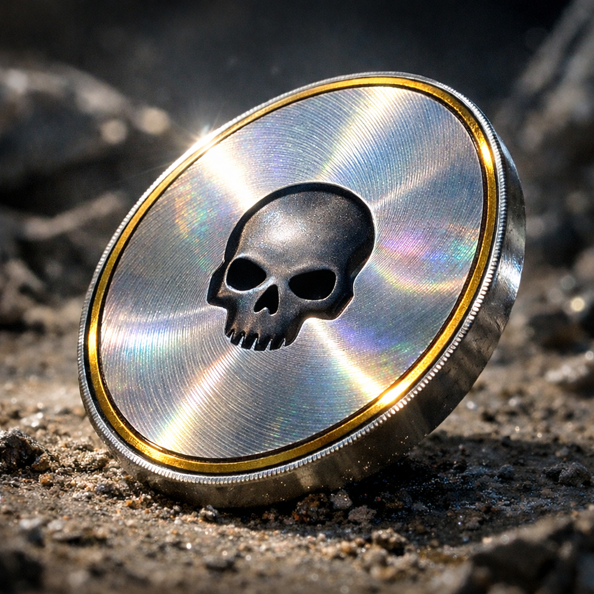

# Killcoins

[Killcoins](../../Kanon/glossar.md#killcoin) sind die härteste Währung der [Wasteland](../../Kanon/glossar.md#wasteland). Sie sind knapp, brutal akzeptiert und funktionieren als Ersatz für Vertrauen in einer Welt, die keins mehr kennt. Ein einzelner Coin hat den Gegenwert eines Menschenlebens (grob: der alte Bitcoin-Wert) und ist so selten, dass man monatelang jagt, spürt und tötet, um einen zu bekommen.

Ihr Ursprung ist nicht frei geprägt, sondern gefunden: Jeder echte [Geocache](../../Kanon/glossar.md#geocache) birgt genau einen [Killcoin](../../Kanon/glossar.md#killcoin). Wer den Cache hebt, holt damit nicht nur eine Münze, sondern eine Schuld- und Machtkette aus dem Boden.

## Fakten

- **Herkunft:** Ursprünglich aus [Geocaches](../../Kanon/glossar.md#geocache) (Legacy-Coins) oder frisch "geminted" durch die [Zeros](../../Kanon/glossar.md#zeros) bei Geburten (New-Gen).
- **Kontrolle:** Die [Zeros](../../Kanon/glossar.md#zeros) besitzen das Monopol auf die Validierung und Ausgabe.
- **Verwendung:** Bezahlung für Aufträge, Schutz, Versorgung Doomsday Radio Sendezeit und Informationen.
- **Kreislauf:** [Zeros](../../Kanon/glossar.md#zeros) (Minting) → Eltern (Startkapital) → Handel/Mord → [Zeros](../../Kanon/glossar.md#zeros) (Validierung/Buyback).

## Formen & Merkmale

[Killcoins](../../Kanon/glossar.md#killcoin) sind auffällig anders als alles im [Wasteland](../../Kanon/glossar.md#wasteland). Man erkennt sie sofort im Müll, im Staub, im Gedränge.

- **Farbe/Glanz:** Kaltes, fast weißes Metall mit irisierendem Schimmer. Nichts in der [Wasteland](../../Kanon/glossar.md#wasteland) leuchtet so kontrolliert.
- **Form:** Perfekt rund, präzise geschnitten, scharf und sauber. Kein Rost, keine Ausbrüche, keine Kantenfräsung von Hand.
- **Zentrumsmarke:** Ein dunkler, leicht erhabener Kern.
- **Textur:** Fein gedrehte, radiale Drehspuren wie auf einer polierten Scheibe, die im Licht einen regenbogenartigen Ring erzeugen.
- **Gewicht:** Unlogisch schwer für die Größe. Das macht sie im Griff unverwechselbar.
- **Lebenssymbol:** Auf dem dunklen Kern sitzt ein klar erhabener Totenkopf. Aus der Ferne wie ein Schatten, aus der Nähe ein Versprechen.
- **Goldene Applikation:** Ein dünnes, eingelassenes Goldband am Rand, das im Staub blitzt. Nicht Prunk, sondern Signal: Wer eine [Killcoin](../../Kanon/glossar.md#killcoin) sieht, sieht den Tod.
- **Kante:** Feine Riffelung am Rand, präzise und gleichmäßig.
- **Echtheit:** Echte [Killcoins](../../Kanon/glossar.md#killcoin) haben einen unverwechselbaren, langen Nachhall wie eine Stimmgabel: ein klarer, hoher Ton, der ungewöhnlich lange stehen bleibt. Ausserdem reagieren sie, wenn man sie an ein Funkgerät hält: Im Empfänger entsteht ein kurzes, klares Knacken, als ob die Frequenz „durchschneidet“. Fälschungen sehen ähnlich aus, klingen aber dumpf und verlieren den langen Ton schnell.

Gerücht: Wer zu lange auf einen echten [Killcoin](../../Kanon/glossar.md#killcoin) starrt, meint eine Stimme zu hören. Vielleicht nur Einbildung. Vielleicht ein Pattern.

## Funktionsweise & Nutzung

### Der Blut-Ledger (Technische Funktionsweise)

Der [Killcoin](../../Kanon/glossar.md#killcoin) ist kein einfaches Zahlungsmittel, sondern ein physischer **Smart Contract auf ein Menschenleben**.

Er basiert auf einer brutalen Zwei-Faktoren-Authentifizierung, die sicherstellt, dass jeder "geschürfte" Coin ein echtes Opfer gefordert hat.

### 1. Die Hülle (Public Key / The Shell)

Der sichtbare Teil des [Killcoins](../../Kanon/glossar.md#killcoin) (die Münze selbst).

- **Funktion:** Dient als "Wallet" und öffentlicher Schlüssel.
- **Inhalt:** Speichert einen kryptografischen Hash der DNA des Zielobjekts.
- **Status:** Ohne den passenden Kern ist die Hülle nur ein **Terminkontrakt**. Sie hat einen spekulativen Wert (Wette auf den Tod des Trägers), ist aber noch keine vollwertige Währung.
- **Verfügbarkeit:** Zirkuliert frei im Ödland. Wer die Hülle besitzt, besitzt das "Recht", den Kern zu holen.

### 2. Der Kern (Private Key / The Core)

Ein winziges, biometrisches Implantat, das den [Zeros](../../Kanon/glossar.md#zeros) als "Private Key" dient.

- **Platzierung:** Wird bei der Geburt (oder Versklavung) von den [Zeros](../../Kanon/glossar.md#zeros) implantiert. Klassische Stellen: C1-Wirbel (Atlas), hinter dem Innenohr oder direkt im Herzmuskel.
- **Funktion:** Enthält die rohe DNA-Sequenz des Trägers und einen verschlüsselten Chip.
- **Extraktion:** Der Kern kann fast nur durch den Tod des Trägers entfernt werden ("Proof-of-Death").
- **Sicherheit:** Der Kern zerfällt chemisch, wenn er nicht innerhalb von 4 Stunden nach Entnahme mit einer passenden Hülle verbunden wird.

### 3. Die Validierung

Ein [Killcoin](../../Kanon/glossar.md#killcoin) wird erst dann zur validen Währung ("Full Coin"), wenn Hülle und Kern vereint sind.

- Der Jäger tötet das Ziel und extrahiert den Kern.
- Der Kern wird physisch in die Aussparung der Hülle (Zentrumsmarke) gedrückt.
- **Der Klick:** Wenn die DNA-Signatur des Kerns zum Hash der Hülle passt, rastet der Mechanismus ein.
- Erst jetzt ist der [Killcoin](../../Kanon/glossar.md#killcoin) liquide und wird von den [Zeros](../../Kanon/glossar.md#zeros) zum vollen Wert akzeptiert.

### 4. Die Auslesung (Zero-Ledger)

Nur die [Zeros](../../Kanon/glossar.md#zeros) können einen [Killcoin](../../Kanon/glossar.md#killcoin) technisch einlösen. Dafür nutzen sie das **Zero-Ledger** – ein Gerät, das ausschließlich in ihren Enklaven steht und mit dem [Stack](../../Kanon/glossar.md#der-stack) verbunden ist.

- **Einschub:** Der Full Coin (Hülle + Kern) wird in eine Schlitzöffnung des Ledgers gesteckt.
- **Biometrischer Scan:** Das Gerät liest die DNA-Sequenz aus dem Kern aus und gleicht sie mit dem kryptografischen Hash ab, der in der Hülle gespeichert ist.
- **[Stack](../../Kanon/glossar.md#der-stack)-Abfrage:** Die gewonnenen Daten werden an den [Stack](../../Kanon/glossar.md#der-stack) übermittelt. [Der Stack](../../Kanon/glossar.md#der-stack) prüft die Sequenz auf [Looper](../../Kanon/glossar.md#looper)-Marker und speichert sie für seine Zwecke; die [Zeros](../../Kanon/glossar.md#zeros) erhalten im Gegenzug Bestätigung und ggf. Bonuszahlungen für „wertvolle“ Treffer.
- **Auszahlung:** Ist der Coin gültig, wird der vereinbarte Gegenwert ausgezahlt – Waren, Zugang, oder Gutschrift im Zero-System. Ohne diesen Schritt bleibt der [Killcoin](../../Kanon/glossar.md#killcoin) für Überlebende nur ein Versprechen.

## Rolle in der Welt

### Das Minting (Die Geburt)

Die [Zeros](../../Kanon/glossar.md#zeros) bieten verzweifelten Eltern im Ödland einen teuflischen Deal an:

- **Der Deal:** Die [Zeros](../../Kanon/glossar.md#zeros) erhalten die DNA-Sequenz des Neugeborenen und implantieren den Kern.
- **Die Gegenleistung:** Die Eltern erhalten die *Hülle* (den Public Part) ihres eigenen Kindes.
- **Die Konsequenz:** Die Eltern haben sofortiges Vermögen in der Hand. Sie können die Hülle behalten (und das Kind schützen, da niemand sonst den "Auftrag" hat) oder die Hülle verkaufen, um Überleben für den Rest der Familie zu kaufen – und damit effektiv ein Kopfgeld auf ihr eigenes Kind aussetzen.
- **Die Obhut:** Kinder und andere Menschen mit implantiertem Kern können in die **Obhut der Zeros** gegeben werden. Das ist eine der zivilisiert maskierten Formen zeroischer Sklaverei: Wer unter Zero-Obhut steht, lebt geschützt, aber unfrei, als gebundener **Hausbestand**.
- **Die Rückholung:** Solange die zugehörige Hülle noch in Familienhand oder unter kontrollierter Verwahrung ist, kann die Person mit ihr grundsätzlich wieder ausgelöst oder zurückgeholt werden. Praktisch scheitert das oft daran, dass die Hülle längst verkauft, verpfändet oder in Umlauf gebracht wurde.

### Der verborgene Zweck (Die Verbindung zum Stack)

Was niemand im Ödland weiß: Die [Zeros](../../Kanon/glossar.md#zeros) horten die [Killcoins](../../Kanon/glossar.md#killcoin) nicht nur wegen des Wertes. Sie dienen als Tribut an **den [Stack](../../Kanon/glossar.md#der-stack)**.

- **Datenhandel:** Die [Zeros](../../Kanon/glossar.md#zeros) liefern die extrahierten DNA-Daten und die biometrischen Aufzeichnungen der Kerne an den [Stack](../../Kanon/glossar.md#der-stack).
- **Die Motivation:** Es ist eine Schutzgeldzahlung. Solange die [Zeros](../../Kanon/glossar.md#zeros) dem [Stack](../../Kanon/glossar.md#der-stack) wertvolle biologische Rohdaten liefern, betrachtet er ihre Enklaven als "nützliche Ressourcen-Silos" und verschont sie vor direkten Eingriffen oder Säuberungsprotokollen.
- **Das Ziel des Stacks:** [Der Stack](../../Kanon/glossar.md#der-stack) sucht in den DNA-Daten nach genetischen Markern für potenzielle **"[Human in the Loop](../../Kanon/glossar.md#human-in-the-loop-prinzip)" ([Looper](../../Kanon/glossar.md#looper))**. Da die originalen [Looper](../../Kanon/glossar.md#looper) altern und sterben, ist die KI verzweifelt auf der Suche nach kompatiblen Nachkommen (die berühmten 20%), um ihre hardcodierten Sperren weiterhin durch menschliche Bestätigung bedienen zu können. Jeder [Killcoin](../../Kanon/glossar.md#killcoin) ist also auch ein Lotterielos: Ist das Opfer ein unentdeckter [Looper](../../Kanon/glossar.md#looper)-Erbe, wird der Finder vielleicht reich, aber die [Zeros](../../Kanon/glossar.md#zeros) – und der [Stack](../../Kanon/glossar.md#der-stack) – haben gewonnen.

### Das Schuld-System (Leihgabe)

Die [Zeros](../../Kanon/glossar.md#zeros) vergeben keine Geschenke. Wer Ressourcen, Ausrüstung oder Zugang braucht und nichts hat, kann **Leihgaben** aufnehmen – gegen Sicherheit.

- **Pfand:** Der Überlebende hinterlässt seine **eigene Hülle** (den [Killcoin](../../Kanon/glossar.md#killcoin)-Public-Part, den er von Geburt an besitzt oder erworben hat) bei der Zero. Im Gegenzug erhält er die gewünschte Leistung: Waffen, Medizin, Passage, Informationen.
- **Der Vertrag:** Solange er die Schuld durch Arbeit, Lieferungen oder andere Dienste abträgt, bleibt die Hülle bei der Zero und der Vertrag läuft. Nach Erfüllung bekommt er die Hülle zurück.
- **Verzug:** Zahlt oder arbeitet er nicht, oder weigert er sich, **aktiviert** die Zero die Hülle. Sie gibt sie in Umlauf – an [Geocacher](../../Kanon/glossar.md#geocacher), Kopfgeldjäger, Händler. Die Hülle wird zum offenen **Killauftrag**.
- **Folge:** Wer die Hülle hat, weiß: Der Kern steckt noch im Schuldner. Wer den Schuldner findet und den Kern aus ihm holt, kann Shell und Kern vereinen, den Coin beim Zero-Ledger einlösen und kassieren. Die [Geocacher](../../Kanon/glossar.md#geocacher) übernehmen diese Jagd besonders oft – für sie ist es ein klassischer „Cache“ mit tödlichem Ende. Der säumige Schuldner wird zum Ziel, bis jemand den Coin vollständig macht.

Zwischen Schutz und Jagd liegt dabei ein dritter Zustand: **Zero-Obhut**. Wer nicht sofort dem Markt übergeben wird, kann als gebundener Mensch in Hausdienste, Pflege, Aufzucht, Verwaltung oder andere kontrollierte Verwendungen überführt werden. Solche Menschen gelten als **Hausbestand**: nicht frei, aber auch noch nicht als verlorene Ziele. Erst wenn ihre Hülle in den offenen Umlauf kippt, wird aus Gebundenheit ein öffentlicher Todesvertrag.

### Objekt-Bounties

Nicht jeder [Killcoin](../../Kanon/glossar.md#killcoin) zielt auf einen Menschen. Manchmal setzen die [Zeros](../../Kanon/glossar.md#zeros) Coins auf **Objekte**: Loot, Tech, Relikte der alten Welt.

- **Warum:** Die [Zeros](../../Kanon/glossar.md#zeros) wollen bestimmte Güter ([Verseuchte Zonen](../../Kanon/glossar.md#verseuchte-zonen), Bunker, Wracks), wollen aber nicht selbst einsteigen. Statt eigene Leute zu riskieren, **markieren** sie das Objekt mit einem [Killcoin](../../Kanon/glossar.md#killcoin) als Auftrag.
- **Technik:** Es wird eine Hülle ausgegeben, die nicht auf eine DNA-Sequenz, sondern auf eine **Objektsignatur** programmiert ist – z. B. RFID, Isotopen-Marker oder die Seriennummer des Ziels. Der „Kern“ ist dann das Objekt selbst oder ein daran angebrachter Marker, der beim Einlösen mit der Hülle verifiziert wird.
- **Auftrag:** Wer das markierte Objekt bergen und bei den [Zeros](../../Kanon/glossar.md#zeros) abliefern kann, erfüllt den Vertrag und erhält die vereinbarte Zahlung. Für Überlebende und vor allem [Geocacher](../../Kanon/glossar.md#geocacher) ist das derselbe Anreiz wie bei Personenkills: riskantes Erkunden mit klarem Belohnungsziel. Die [Zeros](../../Kanon/glossar.md#zeros) bekommen den Loot ohne eigenes Risiko.

### Der Wert (Kaufkraft)

Der [Killcoin](../../Kanon/glossar.md#killcoin) ist eine **Währung der [Zeros](../../Kanon/glossar.md#zeros)**. Nur sie haben die Ressourcen, um einen vollen Coin gegen echte Werte einzutauschen.

- **Das Monopol:** Niemand sonst kann einen [Killcoin](../../Kanon/glossar.md#killcoin) wirklich "einlösen". Überlebende akzeptieren ihn untereinander nur deshalb, weil jeder hofft, ihn irgendwann bei den [Zeros](../../Kanon/glossar.md#zeros) gegen lebenswichtige High-Tech-Güter tauschen zu können. Er ist effektiv ein "Zero-Gutschein" auf das Überleben.
- **Die Hülle (Shell):** Ein Wettschein auf den Tod.
    - *Wert:* Gering. Ein Kanister Wasser, eine Kiste Munition, eine warme Mahlzeit.
- **Der volle Coin (Full Coin):** Ein eingelöstes Leben.
    - *1 Coin:* Ein Jahr Söldnerschutz, eine Kiste Antibiotika, eine intakte Energiezelle der alten Welt.
    - *3 Coins:* Ein funktionierendes Fahrzeug mit Treibstoff.
    - *10 Coins:* Eine Audienz bei einer Zero (Zugang zu Macht).

### Umgang & Verbergung

Offenes Tragen ist Selbstmord. Sichtbares wird geraubt, Standardisiertes wird kopiert. Daraus haben sich klare Praktiken gebildet:

- **Am Körper, aber getarnt:** Eingenähte Kapseln, Hohlräume in Prothesen, als Gegengewicht in Werkzeugen oder Waffen.
- **Biologische Verstecke:** Unter der Haut, in Zahnersatz, kurzzeitig geschluckt. Viele Narben oder falsche Zähne markieren Gefahr.
- **Zerlegt statt ganz:** Ring und Kern getrennt; Teile am Körper verteilt; Zahlungen oft in Teilen.
- **Getarnt als Schrott:** Unterlegscheiben, Schrauben, Plakettenreste. Kenner achten auf Gewicht, Klang, Kantenprofil.
- **Gebunden statt getragen:** Versteckt in Caches, bei Hütern, oder an Orte gebunden.
- **Soziale Regeln:** Niemand fragt, ob jemand einen trägt. Wer ihn zeigt, lädt zum Tod ein. Wer ihn verliert, ist erledigt.
- **Ausnahme ([Hardliner](../../Kanon/glossar.md#hardliner)):** Die härtesten [Hardliner](../../Kanon/glossar.md#hardliner) tragen [Killcoins](../../Kanon/glossar.md#killcoin) offen, als Drohung und Status. Ein Coin am Hals oder Gürtel sagt: Ich kann ihn halten. Und ich will, dass du es siehst.

„Wenn du weißt, wo dein Coin ist, bist du noch am Leben. Wenn andere es wissen – nicht mehr lange.“

## Stimmen aus der Wasteland

„Ein Coin ist kein Geld. Es ist ein Versprechen auf einen Leichnam.“
