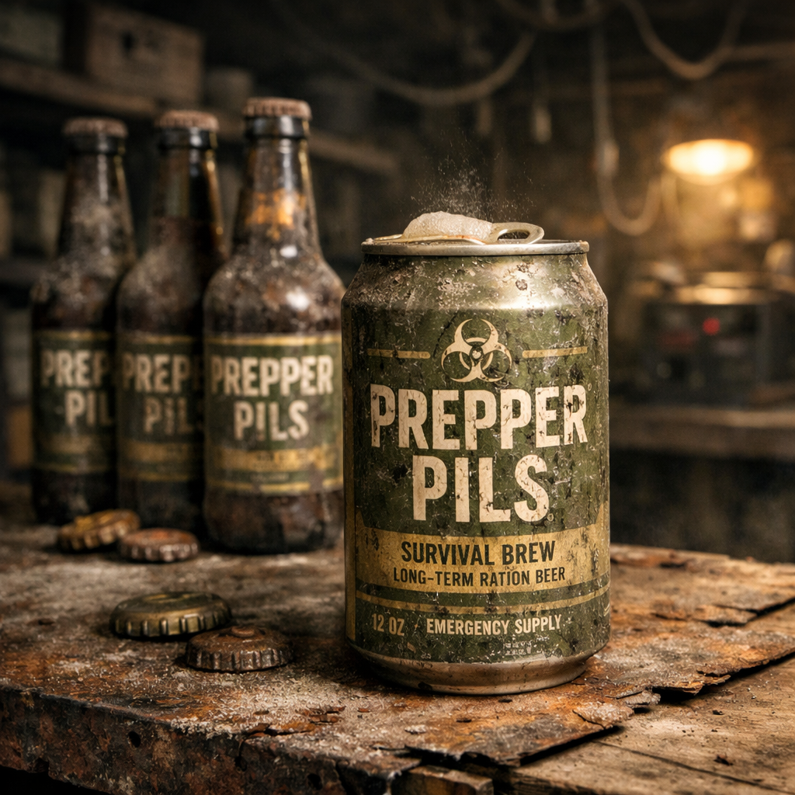

# Prepper Pils

Prepper Pils ist das einzige Bier, das in der [Wasteland](../../Kanon/glossar.md#wasteland) wirklich noch in großem Maßstab existiert. Es wurde in der Vorwelt nicht für Genuss, sondern für Haltbarkeit gebraut: ein extrem stabiles Dosen- und Flaschenbier, ausgelegt auf rund zweihundert Jahre Lagerfähigkeit in Bunkern, Kellern und Prepper-Depots. Genau deshalb hat es den Doomsday überlebt.

Besonders gut ist es nicht. Viele sagen, es schmecke nach Metall, trockenem Brot, altem Filterpapier und einem Rest Hoffnung aus dem Keller. Trotzdem ist Prepper Pils beliebt, weil es eben Bier ist. Und weil es kein anderes gibt.

## Fakten

- **Herkunft:** Vorwelt-Prepperproduktion, eingelagert für Langzeitkrisen, Bunker und autarke Notfalllager.
- **Verfügbarkeit:** Immer noch erstaunlich hoch; große Bestände tauchen in Kellern, Depots, Handelscaches und versiegelten Lagern auf.
- **Verwendung:** Trinkgut, Tauschware, Trostmittel, Feierbier, zynisches Geschenk und Standardalkohol für alle, die sich echtes Genießen nicht mehr leisten können.
- **Beliebtheit:** Hoch, obwohl oder gerade weil jeder weiß, dass es eigentlich nicht gut schmeckt.

## Formen & Merkmale

- **Verpackung:** Meist dickwandige Dosen oder braune Langzeitflaschen mit verblassten Prepper-Etiketten, Haltbarkeitscodes und Warnhinweisen zur sachgerechten Einlagerung.
- **Geschmack:** flach, herb, leicht metallisch, abgestanden-brotig; kalt erträglicher als warm.
- **Zustand:** Viele Chargen sind noch trinkbar, manche nur knapp. Die [Wasteland](../../Kanon/glossar.md#wasteland) hat eine grobe Faustregel: Wenn die Dose nicht bläht und der Geruch nicht nach Lösungsmittel kippt, gilt es als „gut genug“.
- **Erkennungswert:** Das Etikett ist Kult geworden. Wer eine unversehrte Prepper-Pils-Dose sieht, erkennt sie oft schon am olivfarbenen Krisendesign.

## Funktionsweise & Nutzung

- **Warum es noch existiert:** Prepper Pils wurde mit maximaler Stabilität produziert: robust abgefüllt, konservativ gebraut, für Dunkellagerung und jahrzehntelange Notvorräte gedacht.
- **Handel:** Es wird an [Handelsposten](../../Kanon/glossar.md#handelsposten), in Bars und bei Karawanen gehandelt, oft kistenweise aus alten Lagern gezogen.
- **Konsum:** Getrunken wird es bei Abschlüssen, nach Bergungen, vor Rennen, nach Beerdigungen und überall dort, wo Menschen für ein paar Minuten so tun wollen, als wäre die Welt noch irgendwie normal.
- **Sozialer Wert:** Weil es das einzige Bier ist, funktioniert es auch als Gesprächsöffner, Friedensangebot oder armselige Luxusgeste.

## Rolle in der Welt

Prepper Pils ist kein gutes Bier. Es ist das letzte Bier. Genau das macht es zu einem echten Kultgegenstand. In der [Wasteland](../../Kanon/glossar.md#wasteland) reicht das völlig aus: Wer eine Dose auftreibt, hat etwas in der Hand, das nach Vorwelt, Feierabend und verlorener Normalität schmeckt, selbst wenn es objektiv eher nach altem Keller und Blech schmeckt.

An manchen Orten wird es absichtlich warm serviert, um Neuankömmlinge zu demütigen. Andere kühlen es wie einen Schatz, weil selbst schlechtes Bier mit etwas Kälte plötzlich fast nach Würde schmeckt.

## Stimmen aus der Wasteland

„Schmeckt beschissen. Gib noch eins.“
