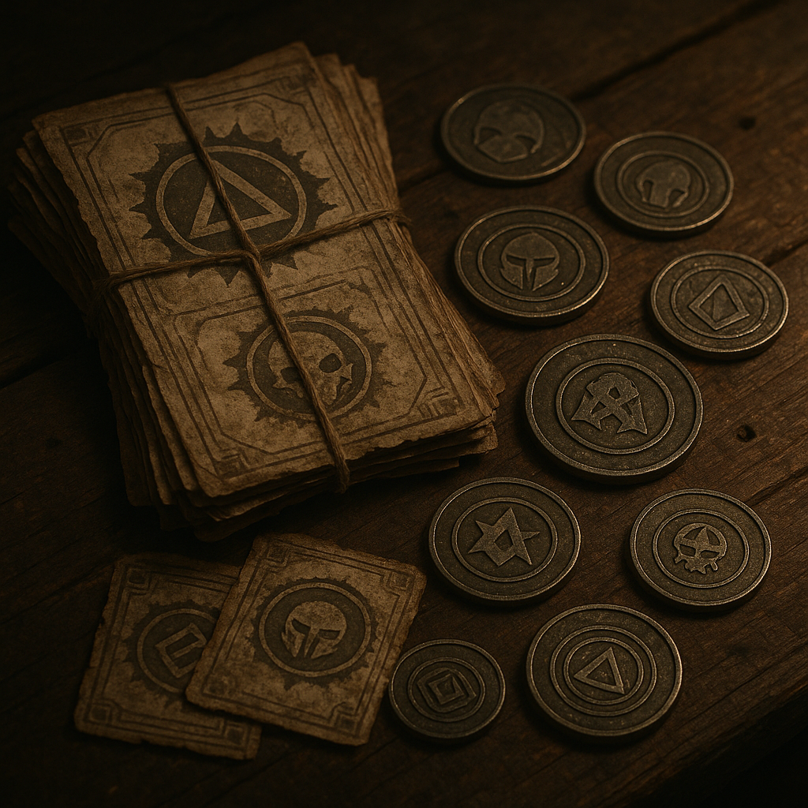

# Scrip

[Scrip](../../Kanon/glossar.md#scrip) – im Ödland meist **[Z-Bucks](../../Kanon/glossar.md#scrip)** genannt – ist das Kleingeld der Enklaven. Kein [Killcoin](../../Kanon/glossar.md#killcoin), kein Blutvertrag: gedruckte oder geprägte Forderungsscheine, die nur bei den [Zeros](../../Kanon/glossar.md#zeros) oder ihren lizenzierten Partnern eingelöst werden können. Wer [Scrip](../../Kanon/glossar.md#scrip) hat, hat Anspruch auf Wasser, Rationen, Passage oder Arbeitsstunden – solange die ausgebende Zero noch steht und honoriert.

Bekanntes Zitat eines Hillbillies "[Z-Bucks](../../Kanon/glossar.md#scrip) sind hier draußen nichts wert."

## Fakten

- **Herausgeber:** Ausschließlich Zero-Enklaven oder von ihnen autorisierte [Handelsposten](../../Kanon/glossar.md#handelsposten).
- **Einlösung:** Nur am ausgebenden Ort oder in Partnernetzen; kein allgemeiner Umtausch wie bei [Killcoins](../../Kanon/glossar.md#killcoin).
- **Verwendung:** Alltagskauf, Lohn, Bestechung, kleine Deals. Kein großer Reichtum, aber Überleben von Tag zu Tag.
- **Risiko:** Wenn eine Enklave fällt oder den [Scrip](../../Kanon/glossar.md#scrip) nicht mehr anerkennt, sind die Scheine wertlos. Überlebende außerhalb der Zero-Zone akzeptieren [Scrip](../../Kanon/glossar.md#scrip) nur mit Skepsis oder gar nicht.

## Formen & Merkmale

- **Papier:** Bedruckt mit Seriennummer, Enklaven-Siegel und oft Ablaufdatum. Fälschungen kursieren; Kenner prüfen Wasserzeichen und Druckqualität.
- **Metall-Marken:** Kleine Plaketten oder Münzen aus minderem Metall, von Zero-Werkstätten geprägt. Haltbarer als Papier, schwerer zu fälschen, aber nur in begrenzten Stückelungen im Umlauf.
- **Digitale Gutschrift:** In einigen Enklaven existieren Konten oder Chips; außerhalb der Mauern irrelevant, da niemand die Infrastruktur hat, sie zu prüfen.

## Funktionsweise & Nutzung

- **Ausgabe:** [Scrip](../../Kanon/glossar.md#scrip) entsteht als Lohn, Vorschuss, Bonus oder kontrollierte Warenfreigabe durch die jeweilige Enklave.
- **Bindung:** Die Kaufkraft hängt an der ausgebenden Instanz; ohne deren Siegel und Akzeptanz ist [Scrip](../../Kanon/glossar.md#scrip) nur Material.
- **Umlauf:** Innerhalb der Enklaven zirkuliert [Scrip](../../Kanon/glossar.md#scrip) schnell und ersetzt den direkten Tausch von Gütern.
- **Grenze:** Außerhalb der Zero-Netze wird [Scrip](../../Kanon/glossar.md#scrip) oft mit Abschlag getauscht oder gar nicht akzeptiert.

## Rolle in der Welt

[Scrip](../../Kanon/glossar.md#scrip) bindet Menschen an eine Zero. Wer für [Zeros](../../Kanon/glossar.md#zeros) arbeitet, wird in [Scrip](../../Kanon/glossar.md#scrip) bezahlt und muss es vor Ort ausgeben – für Essen, Miete, Schutz. Flucht aus der Enklave bedeutet oft, dass das angesparte [Scrip](../../Kanon/glossar.md#scrip) nutzlos wird. Umgekehrt kaufen [Zeros](../../Kanon/glossar.md#zeros) Loyalität und Arbeit billig: Sie drucken oder prägen, was sie wollen, und kontrollieren das Angebot an Waren, gegen die [Scrip](../../Kanon/glossar.md#scrip) eingetauscht werden kann. Für Überlebende in der [Wasteland](../../Kanon/glossar.md#wasteland) sind Zero-Gutscheine vor allem dann interessant, wenn sie [Handelsposten](../../Kanon/glossar.md#handelsposten) ansteuern oder Kontakte zu Zero-Partnern haben – sonst bleibt nur der Tausch gegen echte Güter oder die Hoffnung, irgendwann an einem Ort zu sein, wo [Scrip](../../Kanon/glossar.md#scrip) noch gilt.

## Stimmen aus der Wasteland

„[Scrip](../../Kanon/glossar.md#scrip) ist Vertrauen auf Papier. Und Vertrauen haben nur die [Zeros](../../Kanon/glossar.md#zeros) – in sich selbst.“
