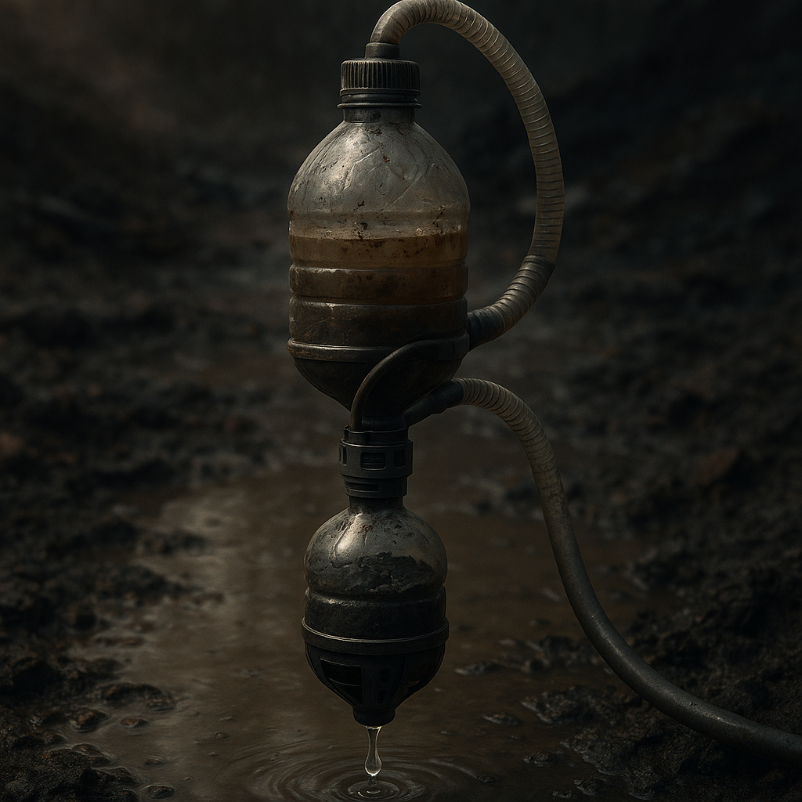

# Wasserfilter

In der [Wasteland](../../Kanon/glossar.md#wasteland) ist trinkbares Wasser knapp und oft verseucht. Wer überleben will, braucht Zugang zu Quellen und eine Möglichkeit, sie zu reinigen. Wasserfilter – ob einfach oder technisch – entscheiden darüber, ob Wasser zum Gut oder zum Gift wird.

## Fakten

- **Anbieter:** [Zeros](../../Kanon/glossar.md#zeros) (auch [Zero Percentler](../../Kanon/glossar.md#zero-percentler); zentrale Aufbereitung in Enklaven), [Steampunks](../../Kanon/glossar.md#steampunks) und andere [Maker](../../Kanon/glossar.md#maker) (Bau, Reparatur), Raub und Handel von Altbeständen.
- **Verwendung:** Trinkwasser, Kochen, medizinische Reinigung, manchmal Bewässerung in geschützten Zonen.
- **Wert:** Hoch. Sauberes Wasser ist oft teurer als Essen; funktionierende Filter sind Handelsgut und werden versteckt oder bewacht.
- **Abhängigkeit:** Wer keinen eigenen Filter hat, ist auf Zero-Distribution, teure Händler oder riskante Quellen angewiesen.

## Formen & Merkmale

- **Improvisierte Filter:** Siebe, Stofflagen, Sand- und Kieskonstruktionen. Günstig und überall baubar, aber begrenzte Wirkung.
- **Patronen- und Aktivkohlefilter:** Tragbar oder stationär, für Alltagscamps und Handelsrouten verbreitet.
- **Destillationssysteme:** Von kleinen Feldgeräten bis zu [Maker](../../Kanon/glossar.md#maker)- oder Zero-Anlagen; hoher Energiebedarf, dafür breite Reinigungswirkung.
- **Enklavenanlagen:** Mehrstufige Zero-Systeme mit Umkehrosmose und UV-Entkeimung, außerhalb der Mauern kaum verfügbar.

## Funktionsweise & Nutzung

- **Wasserquellen:** Oberflächenwasser, Grundwasser sowie Kondensat und Regen sind nutzbar, aber fast immer mit Risiken durch Keime, Chemikalien, Staub oder Strahlung verbunden.
- **Mechanisch:** Siebe, Stoffe, Sand- und Kieslagen entfernen Grobpartikel und einen Teil der Trübung; gegen Keime und gelöste Gifte kaum wirksam.
- **Aktivkohle:** Nimmt Gerüche, Geschmack und viele organische Schadstoffe auf, muss aber regelmäßig getauscht werden.
- **Chemisch:** Chlortabletten, Silberionen oder andere Desinfektionsmittel töten Keime, beeinflussen gelöste Chemikalien oder Strahlung kaum.
- **Destillation:** Wasser wird verdampft und wieder kondensiert; entfernt viele Verunreinigungen inklusive zahlreicher Chemikalien und Radionuklide.
- **Zero-Aufbereitung:** Enklaven filtern zentral und geben Wasser gegen [Scrip](../../Kanon/glossar.md#scrip) oder Leistung aus; Export in die [Wasteland](../../Kanon/glossar.md#wasteland) bleibt begrenzt und teuer.
- **[Verseuchte Zonen](../../Kanon/glossar.md#verseuchte-zonen):** Wasser in [verseuchten Zonen](../../Kanon/glossar.md#verseuchte-zonen) ist oft so belastet, dass nur starke Mehrstufenfilter oder Destillation es halbwegs nutzbar machen.

## Rolle in der Welt

Wasserfilter sind Überlebensausrüstung und Handelsware. Wer einen zuverlässigen Filter hat, ist weniger abhängig von Zero-Wasser und kann auch unterwegs trinken. Defekte oder verstopfte Filter führen zu Krankheit oder Tod; Ersatzteile und Patronen werden getauscht, gestohlen oder als [Objekt-Bounty](Killcoins.md#objekt-bounties) ausgeschrieben. Die [Zeros](../../Kanon/glossar.md#zeros) behalten die Kontrolle, indem sie Technik und Know-how in den Enklaven bündeln – draußen bleibt Filterung oft improvisiert und riskant.

## Stimmen aus der Wasteland

„Sauberes Wasser ist kein Recht. Es ist ein Gerät, ein Feuer und ein bisschen Glück.“
