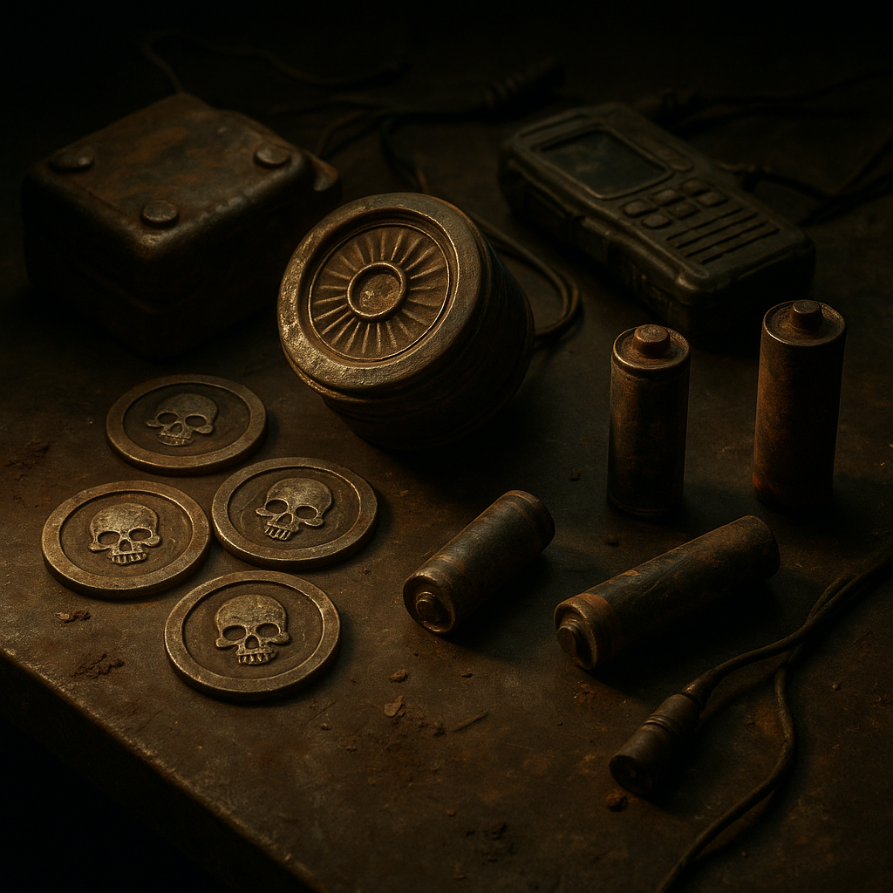

# Gegenstände

Gegenstände sind die tragbaren Fixpunkte der [Wasteland](../../Kanon/glossar.md#wasteland): Währungen, Werkzeuge und Reliquien, die Macht, Risiko und Überleben sichtbar machen.

## Einträge

- [Killcoins](../../Kanon/glossar.md#killcoin) – Harte Währung der [Wasteland](../../Kanon/glossar.md#wasteland), aus Caches, unter Zero-Kontrolle.
- [Scrip](../../Kanon/glossar.md#scrip) – Kleingeld der Enklaven, nur bei [Zeros](../../Kanon/glossar.md#zeros) einlösbar.
- [Energiezellen](Energiezellen.md) – Alte Stromspeicher, wertvoll für Funk und Tech.
- [Wasserfilter](Wasserfilter.md) – Überlebensausrüstung; Herkunft des Wassers und Filtertechnik.
- [COBOL-Code-Artefakt](COBOL-Code-Artefakt.md) – Legacy-Code, den nur [Looper](../../Kanon/glossar.md#looper) lesen können; begehrt von [Orden](../../Kanon/glossar.md#orden) und [Zeros](../../Kanon/glossar.md#zeros).
- [Relaismodule](Relaismodule.md) – Geborgene Signalbauteile aus Relaistieren und Relaisknoten; Schlüsselware im Mesh-Krieg.
- [Wirkstoffe und Rauschmittel](Wirkstoffe-und-Rauschmittel.md) – funktionale Stoffklassen, Risiken und Fraktionslogik.
- [Prepper Pils](Prepper-Pils.md) – Das einzige Bier der [Wasteland](../../Kanon/glossar.md#wasteland): haltbar, reichlich vorhanden, nicht besonders lecker und trotzdem beliebt.
