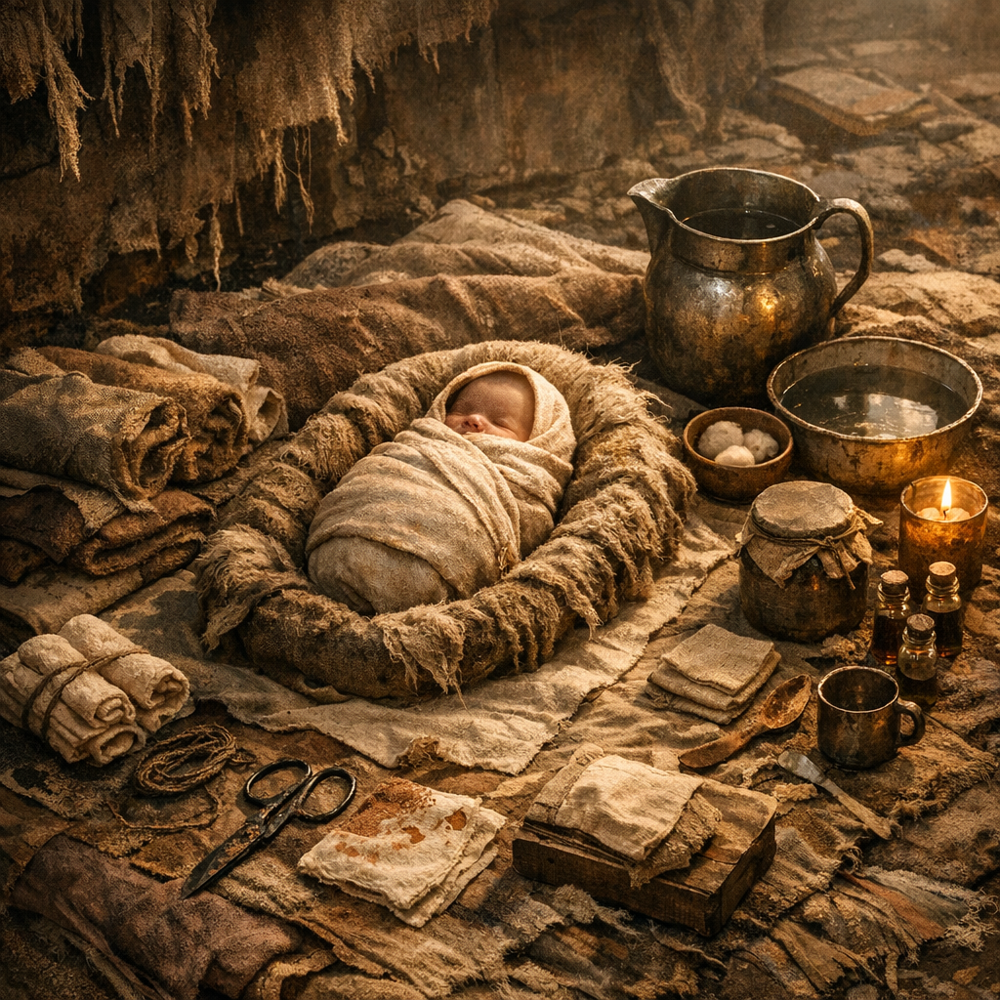

# Aschewiegen-Set

Ein Geburts- und Neugeborenen-Set für eine Welt, in der Geburten meist im Lager, in Ruinen oder am Rand einer Feuerstelle stattfinden und jede saubere Lage schon als Luxus gilt.

## Materialien & Herkunft

- mehrere ausgekochte Stoffstreifen, alte Hemden, Tücher oder saubere Wickel aus Lagerbeständen
- eine kleine Klemme, Schnur oder sauber geglühter Draht für die Nabelbindung
- warmes gefiltertes Wasser aus [Wasserfiltern](../Gegenstaende/Wasserfilter.md), wenn irgend möglich
- eine weiche Unterlage aus trockenem [Moos und Flechten](../Pflanzen/Moose-und-Flechten.md) oder Faserstoff, sauber ausgeschüttelt und umwickelt
- etwas [Weide](../Pflanzen/Weide.md)- oder [Brennnessel](../Pflanzen/Brennnessel.md)-Tee für Ruhe, Wärme und leichte Unterstützung
- kleines Schneidwerkzeug, sauber gehalten oder ausgeglüht

## Herstellung und Anwendung

Das Set wird vorbereitet, bevor die Wehen richtig schlimm werden: Stoff sortieren, Wasser erhitzen, Schneidwerkzeug reinigen, Bindung für den Nabel bereitlegen und einen windstillen Platz schaffen. Gute Geburtshelfer achten weniger auf Romantik als auf Wärme, Ruhe und eine saubere Reihenfolge.

Nach der Geburt wird zuerst das Kind trocken gelegt und warm gewickelt. Dann Nabelbindung setzen, abtrennen und den Rest sauber abdecken. Die gebärende Person bekommt Wasser, Wärme, Druck auf Blutung und möglichst Ruhe. In der [Wasteland](../../Kanon/glossar.md#wasteland) ist Geburt weniger ein Ereignis als eine kontrollierte Grenzsituation.
