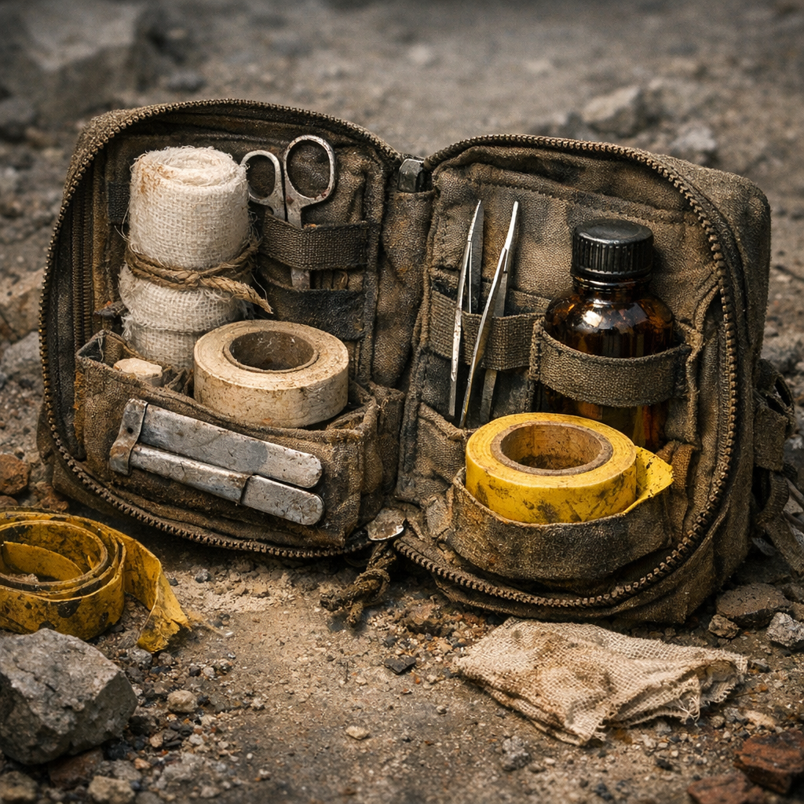

# Cachearzt-Set

Das [Geocacher](../../Kanon/glossar.md#geocacher)-Set für Leute, die weit weg von jeder Hilfe in Löchern, Trassen und Betonrissen unterwegs sind. Es ist auf Verstauchungen, Schnitte, Schürfungen und falsche Tritte gebaut, nicht auf Operationsphantasien.

## Materialien & Herkunft

- kleine Wickel aus Stoff, Klebeband, Schnur und Markerband aus alten Outdoor-Beständen, Caches oder Tauschgeschäften
- flache Schienenstücke aus Kunststoff, Birke oder Metall für Finger und Handgelenke
- Pinzette, kleine Nadel und Messer für Splitter, Dornen und groben Dreck
- eine kleine Flasche Wasser, Moonshine oder Spüllösung
- Druckpolster aus Stoffresten, Moosersatz oder Pflanzenfaser
- ein Logstreifen oder Kreidestück, um Verletzung, Richtung oder Rückweg zu markieren

## Herstellung und Anwendung

Ein Cachearzt-Set wird meist stückweise aus Funden gebaut und immer wieder ergänzt. Gute [Geocacher](../../Kanon/glossar.md#geocacher) halten es klein genug für den Rucksack, aber vollständig genug, um eine schlechte Bergung nicht sofort zur Todesursache werden zu lassen.

Im Einsatz wird erst gereinigt und gedrückt, dann gebunden und geschient. Splitter raus, Wunde zu, Gelenk ruhig, Rückweg markieren. Gerade die Markierung gehört für [Geocacher](../../Kanon/glossar.md#geocacher) zur Medizin, weil niemandem geholfen ist, wenn der Verletzte zwar versorgt, aber im falschen Schacht vergessen wird.

Das Set ist weniger Medizin als Beweglichkeitserhalt. Sein eigentlicher Zweck ist, jemanden lebend bis zum nächsten sicheren Punkt zu bringen.
