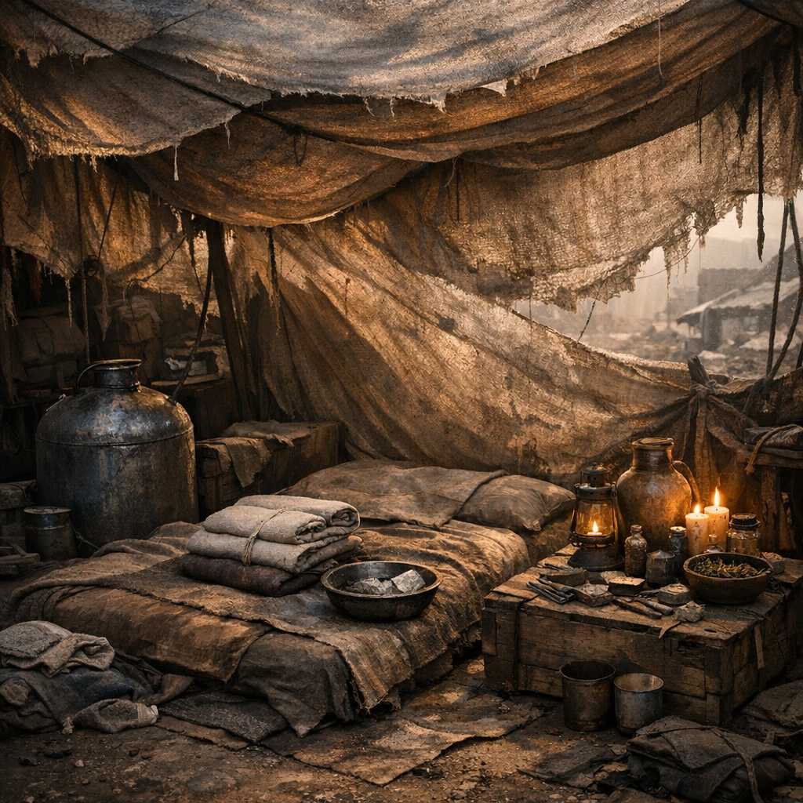

# Fieberschirm Nullwind

Ein Helfer gegen lange Fiebernächte: weniger Mittel als Setting. Schatten, Wickel, Luftführung und kontrollierte Schonung statt hektischer Wundererwartung.

## Materialien & Herkunft

- Tuch, Plane oder leichter Schirmstoff gegen Sonne, Funken und Zugluft
- zwei bis drei Wickelstreifen, immer wieder mit Wasser benetzbar
- Becher, Flasche oder kleines Gefäß für Trinkgaben
- eine dünne Unterlage aus Stoff, Matte oder Faser
- Wasser, möglichst gefiltert
- bei geordneten Lagern zusätzlich Temperaturmarker, Notiz oder Wachwechselplan

## Herstellung und Anwendung

Der Schirm wird so gebaut, dass Luft geht, aber kein harter Wind direkt auf die kranke Person fällt. Dann kommen kühle Wickel an Stirn, Nacken oder Arme, kleine Schlucke Wasser in festen Abständen und möglichst wenig Lärm.

Das Entscheidende ist die Regelmäßigkeit. Jemand muss nachsehen, neu benetzen, trinken lassen und im Blick behalten, ob das Fieber sinkt, steigt oder kippt. In der [Wasteland](../../Kanon/glossar.md#wasteland) ist gute Krankenpflege oft einfach das, was nicht nach zwei Stunden vergessen wird.
