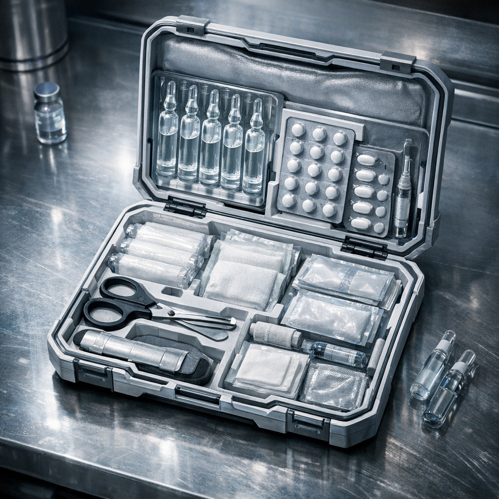

# Glaspforten-Reinset

Zero-nahe Medizin für Leute, die zahlen können oder bezahlt werden müssen. Kein Mythos, sondern saubere Priorisierung: reinigen, stillen, sichern, dosieren.

## Materialien & Herkunft

- versiegelte Reinwasserampullen oder kleine Flaschen aus Zero-Lagern und Märkten rund um die [Glaspforte](../../Orte/Handelsposten/Glaspforte.md)
- sterile oder halbsterile Tücher, Kompressen und Fixierbänder
- einfache Schmerzmittel, Sedativa oder fiebersenkende Resttabletten aus kontrollierter Abgabe
- kleine Klemme, Schere, Pinzette und Handschuhersatz
- eine dünne Schiene oder vorgeformte Stabilisierung für Finger, Handgelenk oder Unterarm

## Herstellung und Anwendung

Das Set ist kein Bastelprodukt, sondern eine konfektionierte Zusammenstellung. In der [Wasteland](../../Kanon/glossar.md#wasteland) ist genau das schon fast Luxus. Gute Sets bleiben versiegelt, bis sie gebraucht werden, und werden danach neu bestückt, wenn die Zero-Logistik es zulässt.

Anwendung heißt hier: zuerst reinigen, dann stillen, dann ruhigstellen. Reinwasser und Kompressen übernehmen die Wunde, Tabletten oder Tropfen dämpfen Schmerz und Fieber, die Schiene hält, was sonst wieder aufreißt oder schief heilt.

Wer so ein Set besitzt, hat entweder Geld, Verbindungen oder einen Auftraggeber, der ihn noch nicht sterben sehen will.
