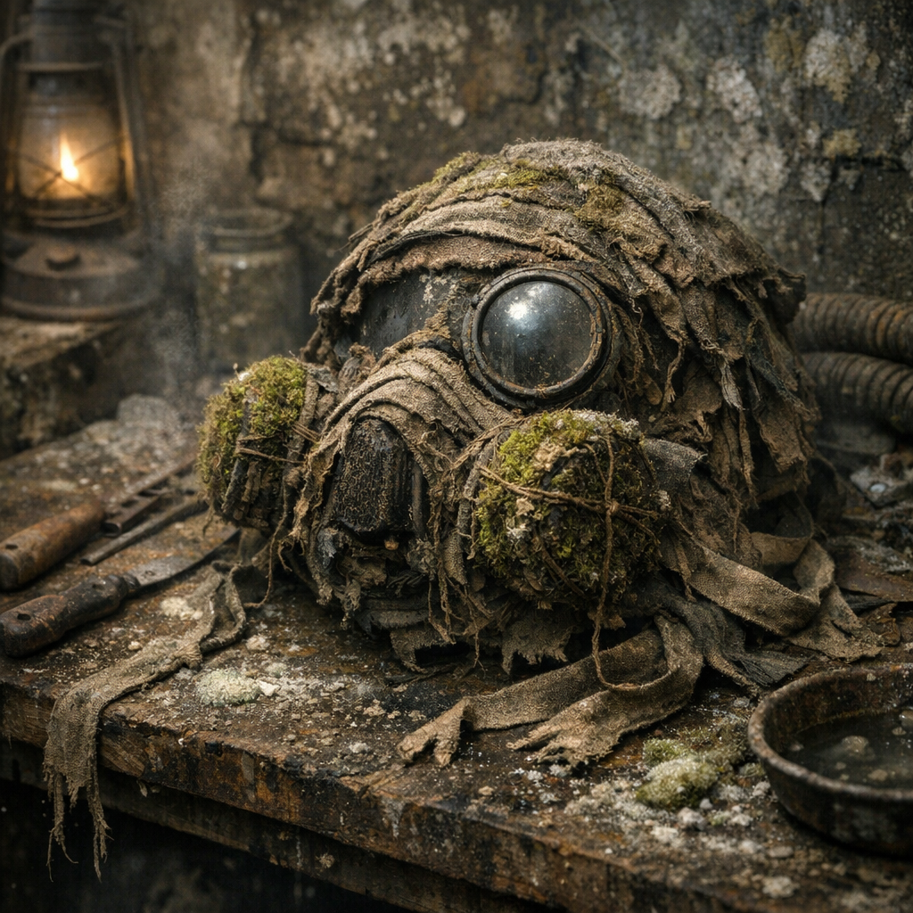

# Kellerfieber-Filterhaube

Ein Schutzstück gegen Staub, Sporen und kranke Luft in Kellern, Schächten und feuchten Innenräumen. Keine perfekte Maske, aber oft der Unterschied zwischen Husten und Zusammenbruch.

## Materialien & Herkunft

- dichter Stoff, Schal, alte Haube oder genähte Stoffhülle
- mehrere Lagen trockene [Moose und Flechten](../Pflanzen/Moose-und-Flechten.md), ausgeschüttelt und nur aus halbwegs lesbaren Bereichen gesammelt
- dünne Pflanzenfaser oder Draht zum Fixieren der Filterlagen
- bei [Maker](../../Kanon/glossar.md#maker)-Varianten etwas Kohle- oder Aschestaub in separater Lage
- Bindebänder aus [Brennnessel](../Pflanzen/Brennnessel.md)- oder Stofffaser

## Herstellung und Anwendung

Die Haube oder Tuchform wird so gelegt, dass Mund und Nase bedeckt sind. Davor kommen mehrere trockene Filterlagen aus Moos, Flechte und Stoff. Alles wird nicht gepresst, sondern leicht geschichtet, damit noch Luft durchkommt.

Vor dem Betreten feuchter Innenräume wird die Haube leicht angefeuchtet oder trocken getragen, je nach Staubart. Wenn sie schwer atmet, modrig wird oder sichtbar Sporen gezogen hat, muss die Filterlage raus und verbrannt oder weit weg entsorgt werden.

Sie heilt nichts. Sie verhindert nur, dass jemand zu viel von einem Raum in die Lunge nimmt.
