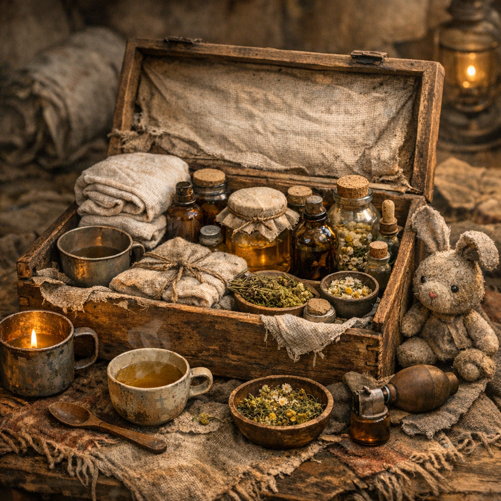

# Kinderatem-Kiste

Ein kleines Gesundheitsset für Kinder: gegen Husten, Fieber, Schürfwunden, Staublunge und jene Art dünner Schwäche, die in der [Wasteland](../../Kanon/glossar.md#wasteland) schnell zu groß wird.

## Materialien & Herkunft

- saubere Wickel, kleine Stofftücher und weiche Polster
- mild verdünnter [Weide](../Pflanzen/Weide.md)- oder [Brennnessel](../Pflanzen/Brennnessel.md)-Aufguss
- gefiltertes Wasser aus [Wasserfiltern](../Gegenstaende/Wasserfilter.md)
- kleine Holzschiene, Pflasterersatz oder Wickelband für Finger und Handgelenke
- etwas Honigersatz, Brombeersud oder süßer Dosenrest, wenn bittere Mittel sonst nicht drinbleiben
- Lampen- oder Wärmewickelzeug für Brust und Hände

## Herstellung und Anwendung

Die Kiste wird meist nicht komplett neu gebaut, sondern sorgsam bestückt und getrennt von allgemeinem Lagerkram gehalten. Bei Kindern zählt Verlässlichkeit mehr als Härte: lauwarme Flüssigkeit, kleine Schlucke, weiche Wickel, Ruhe und Beobachtung.

Genutzt wird sie bei Husten, leichtem Fieber, kleinen Wunden, Staubreiz und Erschöpfung. Erwachsene in der [Wasteland](../../Kanon/glossar.md#wasteland) bekommen oft das Harte. Kinder bekommen, wenn irgend möglich, das Mildere.
