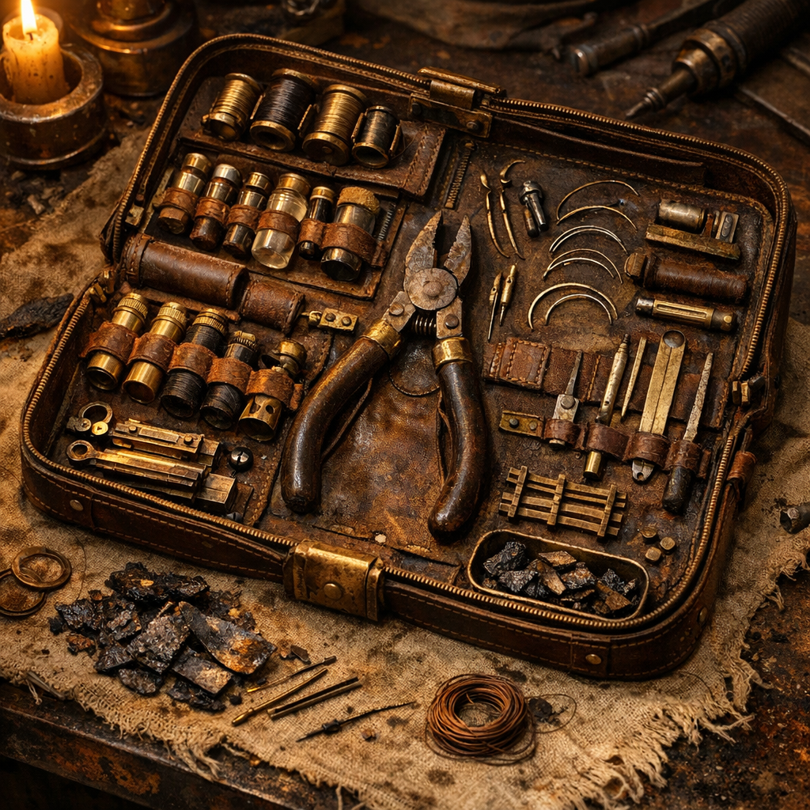

# Messingnaht-Feldkit

[Maker](../../Kanon/glossar.md#maker)-Medizin in Reinform: weniger Heilung als Reparatur. Wenn etwas offen ist, wird es geschlossen. Wenn etwas locker ist, wird es geschient. Wenn etwas stirbt, wird es notfalls abgeschnitten.

## Materialien & Herkunft

- ein kleines Rolltuch oder Blechkästchen mit Nadel, Zange, Haken und Klemme, gebaut in Werkhöfen der [Steampunks](../../Kanon/glossar.md#steampunks)
- ausgekochte Fäden aus Nessel-, Stoff- oder Mischfaser
- zwei bis vier glatte Schienenstücke aus Holz, Draht oder dünnem Schrott
- ein kleiner Brenner, Glutstab oder erhitzbarer Metallpin zum Ausbrennen und Desinfizieren
- gereinigte Stoffstreifen als Druckverband
- nach Möglichkeit Moonshine oder Reinwasser zum Säubern

## Herstellung und Anwendung

Das Feldkit selbst wird nicht gekocht, sondern vorbereitet: Nadel und Metallteile werden regelmäßig ausgeglüht, Fäden trocken und sauber gehalten, Schienen passend zugeschnitten. Gute [Maker](../../Kanon/glossar.md#maker) tragen so ein Set immer gepackt.

Im Einsatz wird zuerst Blutdruck gemacht: drücken, lagern, ruhig halten. Dann reinigen, splittern, klemmen oder nähen, je nachdem, was noch sinnvoll aussieht. Bei Brüchen oder Verstauchungen kommen Schienen und Wickel zum Einsatz, bei tiefen Schnitten Nadel und Faden. Der Brennstift ist die Lösung für kleine Blutungen, schlimme Stellen und große Verzweiflung.

Das Kit rettet nicht elegant. Es sorgt nur dafür, dass jemand transportfähig, arbeitsfähig oder wenigstens bis zum nächsten Feuer am Leben bleibt.
