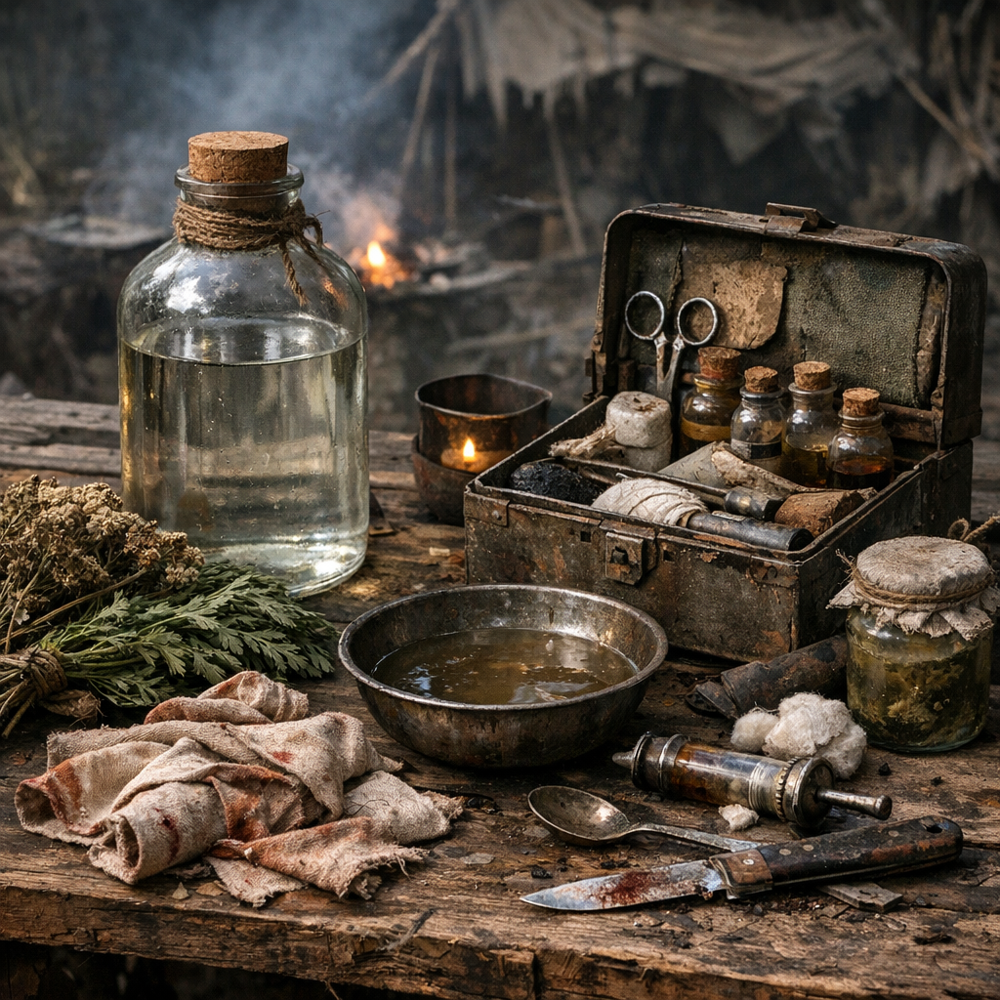

# Moonshine-Wundspülung

Hillbilly-Medizin. Nicht sanft, nicht präzise, aber oft das Erste, was auf eine offene Wunde kommt, wenn sonst nur Dreck, Panik und Fliegen im Lager sind.

## Materialien & Herkunft

- ein halber bis ganzer Becher klarer Moonshine, meist aus [Sumpf-Festung](../../Orte/Handelsposten/Sumpf-Festung.md), Waldclans oder fragwürdigen Tauschgeschäften
- ein kleiner Griff [Beifuss](../Pflanzen/Beifuss.md), an Wegrändern und Schuttflächen gesammelt
- eine Hand voll saubere Stoffstreifen, alte Hemdärmel, ausgekochte Lappen oder zerschnittene Unterkleidung
- nach Möglichkeit ein halber Becher gefiltertes Wasser aus [Wasserfiltern](../Gegenstaende/Wasserfilter.md), um die Härte etwas zu brechen

## Herstellung und Anwendung

Beifuss grob zerreiben und in den Moonshine werfen. Wer Wasser hat, verdünnt den Schnaps leicht; wer keins hat, nimmt ihn pur und nennt das Entschlossenheit. Die Mischung kurz stehen lassen, bis sie bitter riecht.

Danach die Wunde erst grob von Dreck, Splittern und Blutklumpen befreien. Dann wird der Moonshine langsam direkt über die Stelle gegossen oder mit Stoff aufgetupft. Es brennt so stark, dass manche [Hillbillys](../../Kanon/glossar.md#hillbillys) darin bereits den Wirkbeweis sehen.

Zum Schluss wird die Wunde locker mit Stoff abgedeckt. Die Spülung ist eher dafür da, Dreck rauszunehmen und die Umgebung schlechter für Fäulnis zu machen. Heilen muss der Körper den Rest selbst.
