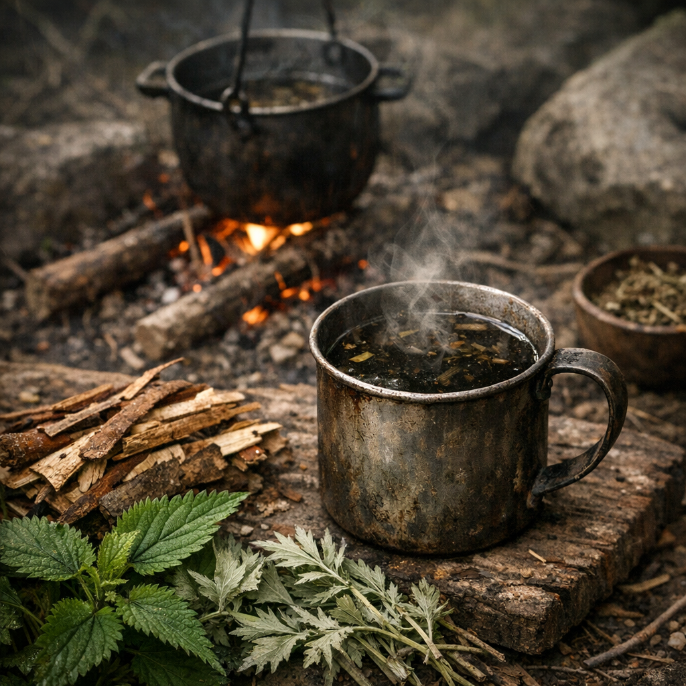

# Retro-Weidenrinden-Sud

Ein Retrosud gegen dumpfen Schmerz, Fieber und Erschöpfung. Kein schneller Kick, sondern langsame Linderung für Leute, die dem Körper noch zutrauen, sich selbst zu sortieren.

## Materialien & Herkunft

- zwei Finger lange Stücke frische oder getrocknete [Weide](../Pflanzen/Weide.md)-Rinde, von Uferweiden oder Sumpfrändern
- ein kleiner Griff [Brennnesseln](../Pflanzen/Brennnessel.md), aus sauberen Randböden
- ein kleiner Griff [Beifuss](../Pflanzen/Beifuss.md), für Bittere und Lagerwirkung
- ein bis zwei Becher Wasser
- optional etwas [Brombeere](../Pflanzen/Brombeere.md), wenn die Bittere gebrochen werden soll

## Herstellung und Anwendung

Die Weidenrinde klein schaben oder brechen und mit Wasser langsam aufkochen. Brennnessel und Beifuss erst später dazugeben, damit sie nicht totgekocht werden. Wer Brombeeren hat, wirft nur wenige hinein, mehr für den Geschmack als für die Wirkung.

Der Sud soll lange ziehen, bis die Brühe dunkel und deutlich bitter wird. Danach langsam in kleinen Schlucken trinken, nicht als schnellen Stoß. [Retros](../../Kanon/glossar.md#retros) setzen auf mehrere kleine Gaben über Stunden statt auf eine große.

Er hilft eher bei ziehendem Schmerz, Fieberdruck und allgemeiner Mattigkeit als bei offenen Katastrophen. Dafür ist er vergleichsweise verlässlich, solange die Pflanzen sauber gesammelt wurden.
