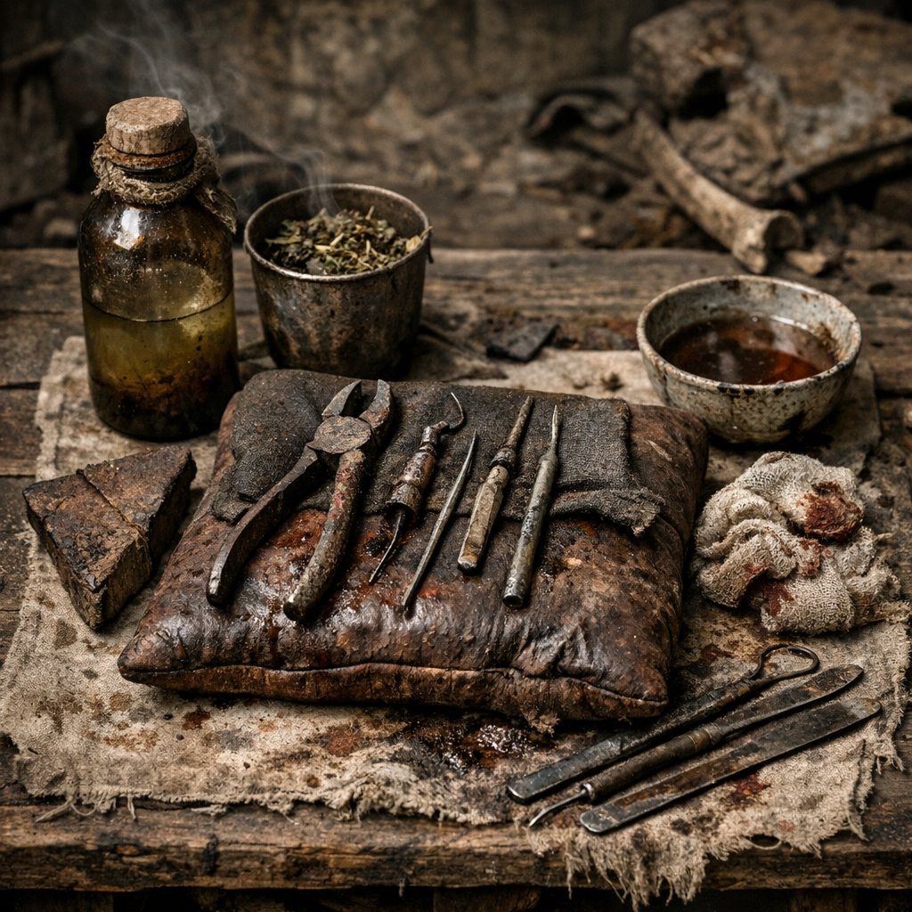

# Splitterzahn-Kit

Zahnmedizin der [Wasteland](../../Kanon/glossar.md#wasteland) ist selten Erhalt, meist Begrenzung von Elend. Das Kit dient zum Lösen, Ziehen, Spülen, Kühlen und Keilen, wenn ein Zahn das ganze Denken auffrisst.

## Materialien & Herkunft

- kleine Zange oder schmale Greifbacke aus Werkstatt- oder Bergungsgut
- Holz- oder Lederkeil zum Draufbeißen
- Moonshine oder Reinwasser zum Spülen
- [Weide](../Pflanzen/Weide.md)-Sud oder [Beifuss](../Pflanzen/Beifuss.md)-Aufguss gegen dumpfen Schmerz
- saubere Stoffstreifen oder kleine Druckpolster
- feiner Draht oder Faden für lockere Schienung von Kieferteilen, nur wenn jemand weiß, was er tut

## Herstellung und Anwendung

Das Kit wird klein gehalten und meist trocken transportiert. Vor Gebrauch werden Metallteile gereinigt und, wenn möglich, ausgeglüht. Dann wird erst gespült, gekühlt und geprüft, ob der Zahn nur gereizt, locker oder tatsächlich raus muss.

Wenn gezogen werden muss, bekommt die betroffene Person Keil und Halt, dann wird schnell und ohne Diskussion gearbeitet. Danach Druck drauf, spülen, still halten. Gute [Wasteland](../../Kanon/glossar.md#wasteland)-Zahnmedizin erkennt man nicht daran, dass es angenehm war, sondern daran, dass die Schmerzen am nächsten Morgen geringer sind als am Abend davor.
