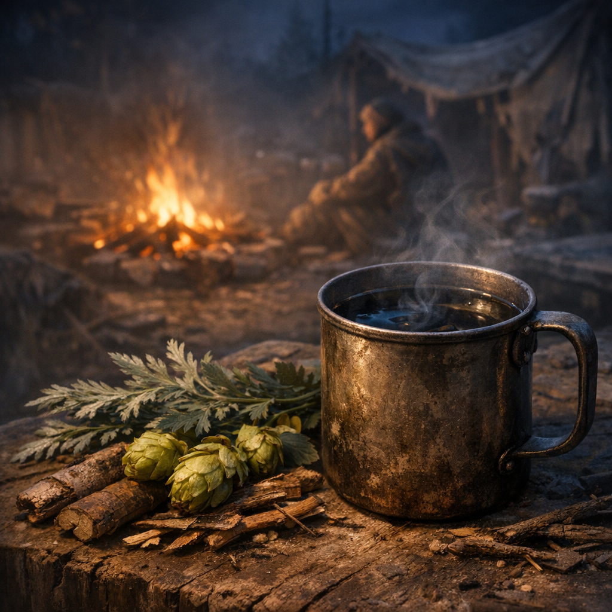

# Stillwache-Schlafsud

Ein Schlaf- und Beruhigungssud für Leute, die seit zu vielen Nächten nicht mehr wirklich unten waren: Zittern, Restangst, Alarmatem, Denken ohne Ende.

## Materialien & Herkunft

- ein kleiner Griff [Wilder Hopfen](../Pflanzen/Wilder-Hopfen.md), von Zäunen und Ruinenkanten
- ein kleiner Griff [Beifuss](../Pflanzen/Beifuss.md)
- etwas [Weide](../Pflanzen/Weide.md)-Rinde für dumpfen Schmerzdruck
- ein bis zwei Becher Wasser
- optional ein winziger Schuss Moonshine, nur wenn die Person nicht schon halb weg ist

## Herstellung und Anwendung

Weidenrinde zuerst langsam ziehen lassen, dann Hopfen und Beifuss erst später zugeben, damit der Sud bitter und schwer, aber nicht aggressiv wird. Er soll nicht betäuben wie ein Schlag auf den Kopf, sondern den Körper in Richtung Ruhe schieben.

Getrunken wird in kleinen Schlucken, an einem halbwegs sicheren Platz, nicht auf Wache und nicht kurz vor Marsch. Ordensleute geben ihn eher rituell, [Hillbillys](../../Kanon/glossar.md#hillbillys) mit Schnaps, [Retros](../../Kanon/glossar.md#retros) still und ohne Worte.
