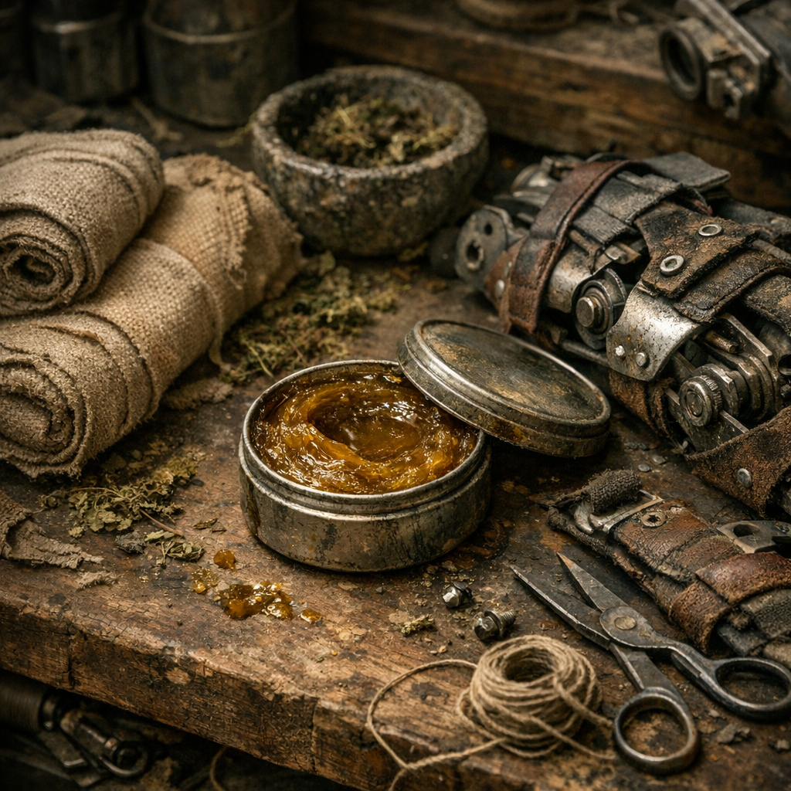

# Stumpfpflege-Harzpaste

Für amputierte Gliedmaßen, scheuernde Prothesenränder und offene Druckstellen. Mehr Pflege als Heilung, aber oft das, was verhindert, dass eine alte Verletzung wieder zum neuen Problem wird.

## Materialien & Herkunft

- ein kleiner Löffel [Kiefer](../Pflanzen/Kiefer.md)-Harz, aus trockenen Beständen oder von Sammlern
- weiches Fett oder Öl als Träger
- etwas zerdrückte [Brennnessel](../Pflanzen/Brennnessel.md) oder [Beifuss](../Pflanzen/Beifuss.md) für die Kräuterschicht
- saubere Stoffstreifen zum Nachwickeln
- optional feines Polstermaterial aus Stofffaser oder sauberem Moos

## Herstellung und Anwendung

Das Harz wird vorsichtig erwärmt und mit Fett geschmeidig gerührt, bis es streichbar bleibt. Dann Kräuter fein einarbeiten. Die Paste gehört nicht tief in frische Wunden, sondern auf verhärtete, gereizte oder scheuernde Ränder.

Erst reinigen und trocknen, dann dünn auftragen, kurz einziehen lassen und danach mit Stoff oder Polster neu anpassen. [Maker](../../Kanon/glossar.md#maker) und Amputierte schwören darauf, weil eine gute Stumpfpflege oft wichtiger ist als jede heroische Reparatur an der Prothese selbst.
