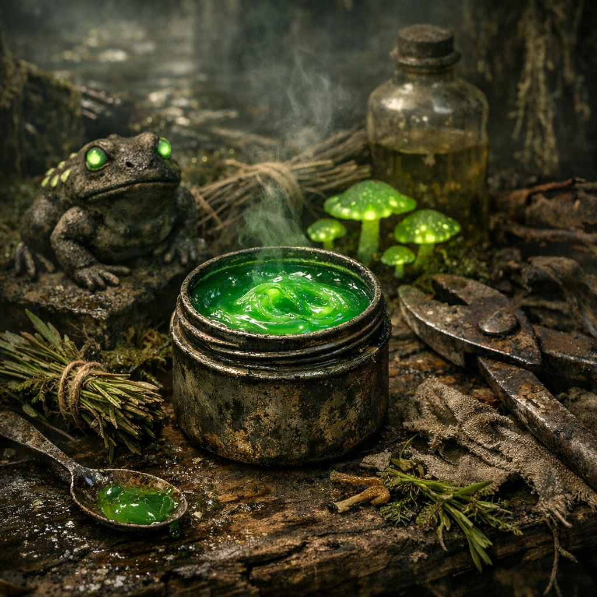

# Sumpflicht-Salbe

Eine sumpfige Hillbilly-Paste gegen stechenden Schmerz, entzündete Gelenke und dumme Mutproben. Sie hilft manchmal. Sie vergiftet manchmal. Genau deshalb wird sie trotzdem benutzt.

## Materialien & Herkunft

- wenige Tropfen gereinigtes Sekret von [Leuchtkröten](../Tiere/Leuchtkroeten.md), gesammelt an Randgewässern oder über Sumpf-Händler
- ein kleiner Griff [Beifuss](../Pflanzen/Beifuss.md), als Trägerkraut
- eine halbe Hand voll zerdrückte [Brennnesseln](../Pflanzen/Brennnessel.md), frisch oder kurz überbrüht
- ein Löffel Fett, Talg oder dickes Öl als Salbengrundlage
- etwas saubere Asche oder feiner trockener Pflanzenstaub zum Binden

## Herstellung und Anwendung

Beifuss und Brennnesseln fein zerreiben und mit warmem Fett zu einer dicken Paste verrühren. Nur sehr wenig Leuchtkröten-Sekret zugeben und die Masse weiter verdicken, bis sie haftet und nicht mehr tropft.

Die Salbe wird niemals auf tiefe offene Wunden geschmiert. Sie gehört auf schmerzende Gelenke, verstauchte Stellen, Insektenstiche oder drumherum, wenn eine Verletzung zu sehr zieht. Dünn auftragen, kurz warten und beobachten, ob die Haut nur warm, taub und dumpf wird oder gefährlich reagiert.

Wenn Schwindel, Fieber oder Halluzinationen anfangen, war es zu viel. Das ist kein Betriebsunfall, sondern Teil des üblichen Risikos.
