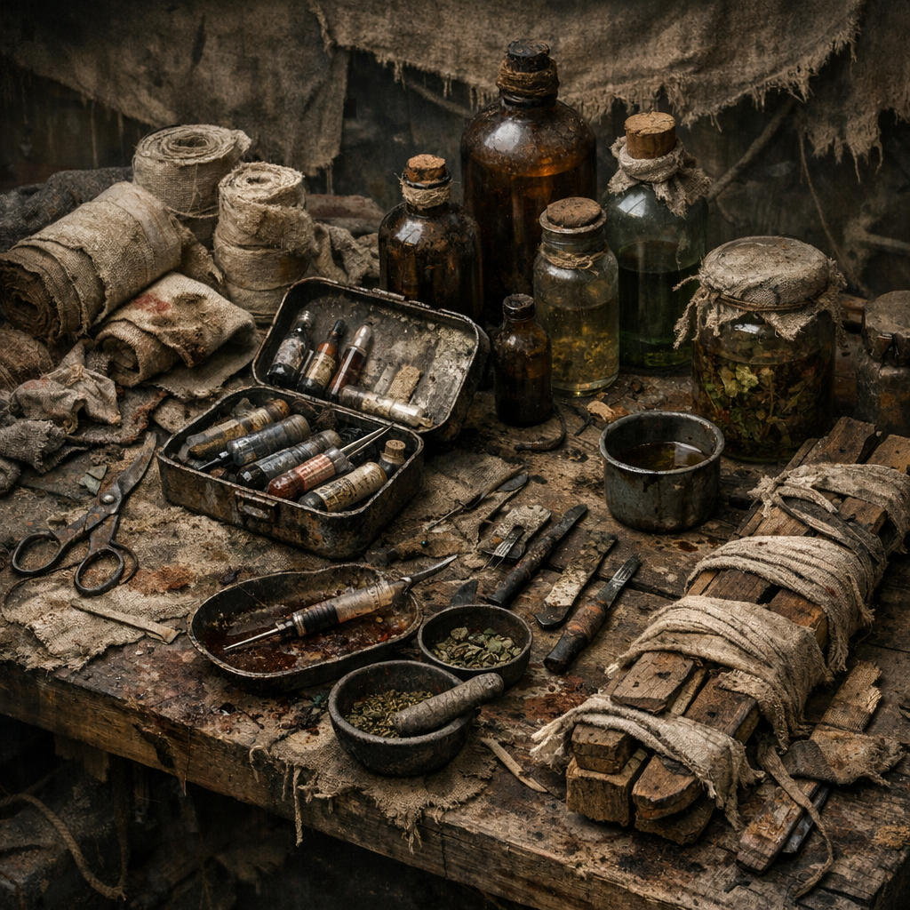

# Medizin

Medizin in der [Wasteland](../../Kanon/glossar.md#wasteland) ist selten sauber, oft improvisiert und fast immer fraktionsabhängig. Was draußen als Heilmittel gilt, kann je nach Herkunft Rettung, Betäubung, Betrug oder langsamer Tod sein. Neben Tränken und Suden zählen auch Nähkits, Druckverbände, Schienen, Reinwasser-Sets und provisorische Diagnostik zur Medizin.

## Einträge

- [Moonshine-Wundspülung](Moonshine-Wundspuelung.md) – Hillbilly-Desinfektion zwischen Medizin, Folter und Gewohnheit.
- [Sumpflicht-Salbe](Sumpflicht-Salbe.md) – riskante Hillbilly-Paste mit Leuchtkröten-Sekret gegen Schmerzspitzen.
- [Messingnaht-Feldkit](Messingnaht-Feldkit.md) – [Maker](../../Kanon/glossar.md#maker)-Set für Nähen, Schienen, Ausbrennen und Weiterlaufen.
- [Pilgerverband Null-Sieben](Pilgerverband-Null-Sieben.md) – Ordensverband aus sauberer Schichtung, Bitterauflage und Disziplin.
- [Glaspforten-Reinset](Glaspforten-Reinset.md) – Zero-nahes Rein- und Versorgungsset mit selten verlässlicher Qualität.
- [Retro-Weidenrinden-Sud](Retro-Weidenrinden-Sud.md) – schmerzlindernder Retrosud aus Waldmaterial und Geduld.
- [Cachearzt-Set](Cachearzt-Set.md) – [Geocacher](../../Kanon/glossar.md#geocacher)-Feldkit für Wunden, Verstauchungen und schlechte Entscheidungen.
- [Aschewiegen-Set](Aschewiegen-Set.md) – Geburts- und Neugeborenenhilfe für Zeiten ohne Klinik und ohne zweite Chance.
- [Kellerfieber-Filterhaube](Kellerfieber-Filterhaube.md) – Sporen- und Staubschutz gegen feuchte Innenräume, Nester und Schimmelzonen.
- [Quarantänepfahl Rotband](Quarantaenepfahl-Rotband.md) – Markier- und Sperrset für Seuchen, Verseuchung und schlechte Luft.
- [Splitterzahn-Kit](Splitterzahn-Kit.md) – Zahnzeug für Ziehen, Spülen, Keilen und irgendwie Weiterbeißen.
- [Stillwache-Schlafsud](Stillwache-Schlafsud.md) – Beruhigungs- und Schlafhilfe gegen Zittern, Alarmrest und Überwachheit.
- [Stumpfpflege-Harzpaste](Stumpfpflege-Harzpaste.md) – Pflegehilfe für Amputationen, Scheuerstellen und Prothesenränder.
- [Kinderatem-Kiste](Kinderatem-Kiste.md) – Set für Fieber, Husten, kleine Verletzungen und die erste dünne Versorgung von Kindern.
- [Fieberschirm Nullwind](Fieberschirm-Nullwind.md) – Kühl-, Wickel- und Schonplatz-Set für lange Krankheitsnächte.
