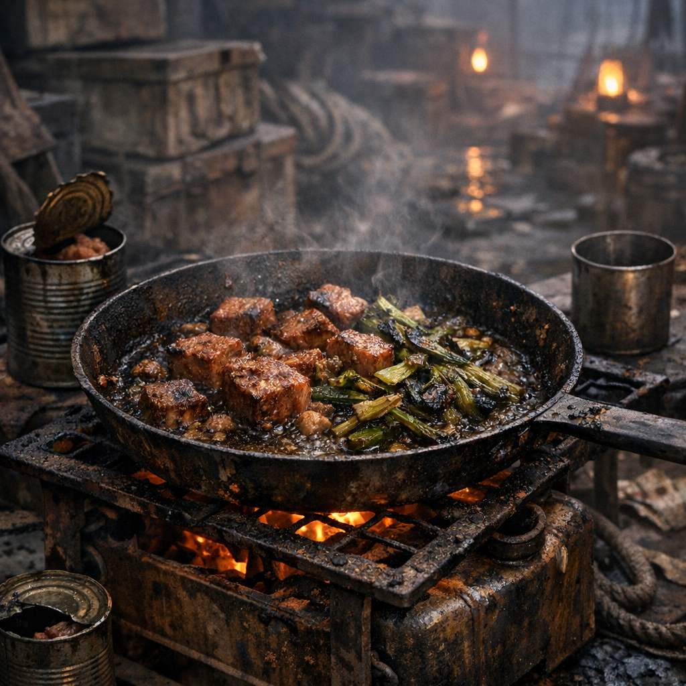

# Aschehafen-Pfanne

Ein typisches Restegericht der Posten: salzig, fettig, schnell und genau richtig für Menschen, die nur eine Pfanne, ein Feuer und schlechte Laune besitzen.

## Zutaten

- eine Dose Fleischreste, Fisch in Lake oder anonyme Eiweißmasse aus Handelskisten, gefunden in Vorratslagern oder am [Handelsposten](../../Kanon/glossar.md#handelsposten) ertauscht
- eine Hand voll klein geschnittene [Rohrkolben](../Pflanzen/Rohrkolben.md)-Triebe oder Rhizome, aus Uferzonen und Schilfrändern
- eine Hand voll [Brennnesseln](../Pflanzen/Brennnessel.md) oder andere brauchbare grüne Reste
- eine halbe Hand voll [Brombeeren](../Pflanzen/Brombeere.md), wenn gerade Saison ist, für Säure und Farbe
- ein Löffel Fett oder direkt das Dosenfett
- eine halbe Dose Bohnen, Mais oder irgendein stückiger Dosenrest, wenn mehr Masse gebraucht wird

## Zubereitung

Erst die Rohrkolbenstücke in Fett anrösten, bis sie weich werden. Dann den Doseninhalt dazugeben und auseinanderdrücken, damit alles brät statt nur zu kochen. Die Brennnesseln zuletzt unterheben, damit sie nicht sofort zu Staub zerfallen.

Wenn vorhanden, zum Schluss ein paar Brombeeren hineinwerfen. Die machen das Gericht nicht feiner, aber weniger stumpf. Wer noch eine halbe Dose Bohnen oder Mais übrig hat, kippt sie ebenfalls dazu und lässt alles zusammenziehen.

Die Pfanne ist fertig, wenn sich am Boden dunkle Röstkanten bilden und nichts mehr wässrig wirkt. Gegessen wird direkt aus der Pfanne oder mit Blechdeckeln als Teller.
