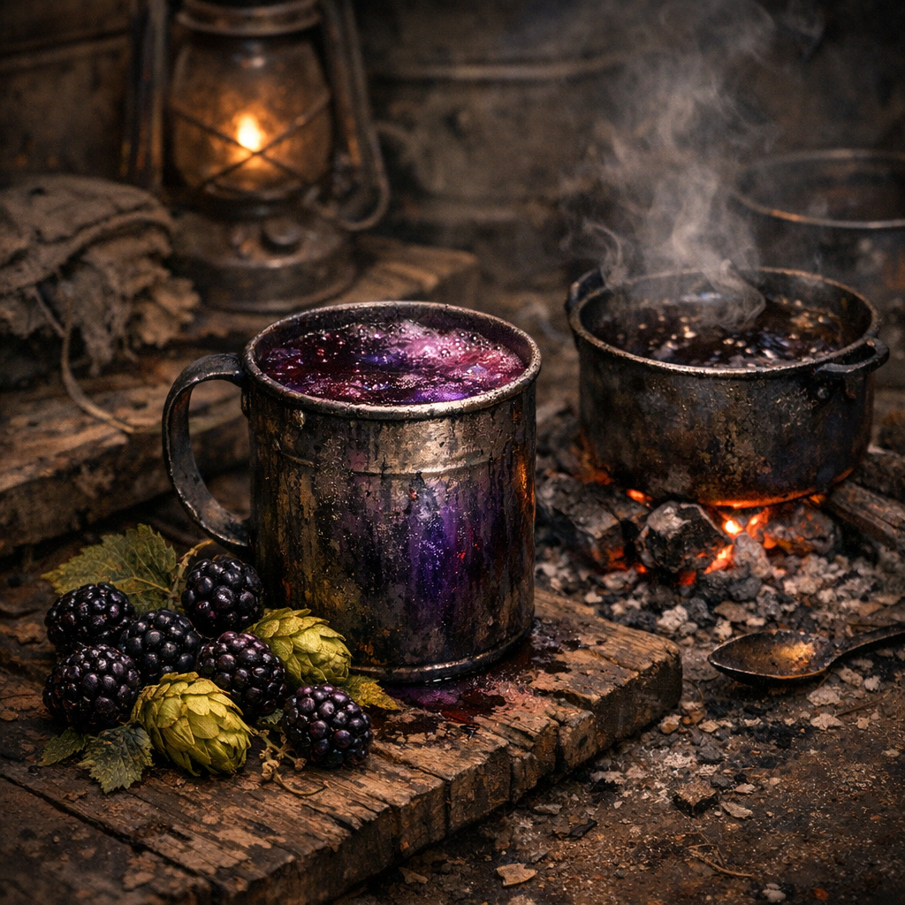

# Brombeer-Hopfen-Sud

Ein bitter-süßer Trunk für seltene gute Abende, Beerdigungen mit Stil oder Leute, die sich einreden wollen, dass das hier fast schon Dessert ist.

## Zutaten

- zwei Hände [Brombeeren](../Pflanzen/Brombeere.md), an Waldrändern, Dornenfeldern oder Hillbilly-Rändern gesammelt
- ein halber bis ganzer Griff [Wilder Hopfen](../Pflanzen/Wilder-Hopfen.md), frisch oder getrocknet
- ein halber Becher zerstoßene Zuckerreste, Sirup aus Dose oder süßer Dosenfraß wie Obstkonserve
- ein bis zwei Becher Wasser
- ein kleiner Schuss [Prepper Pils](../Gegenstaende/Prepper-Pils.md) oder klarer Schnaps, wenn vorhanden

## Zubereitung

Die Brombeeren in einen kleinen Topf oder eine große Dose geben und mit etwas Wasser zerdrücken. Den Hopfen dazuwerfen und langsam aufkochen, bis die Flüssigkeit dunkel wird und die Beeren zerfallen.

Dann die Zuckerreste oder die süße Konserve einrühren. Wenn vorhanden, kommt ganz zum Schluss ein kleiner Schuss Prepper Pils oder Schnaps dazu, nur für Bittere und Halt.

Den Sud noch so lange ziehen lassen, bis er zugleich fruchtig und herb riecht. Danach durch Stoff, Drahtsieb oder einfach zwischen den Zähnen trinken. Warm wirkt er wie Trost, kalt wie ein Witz aus der alten Welt.
