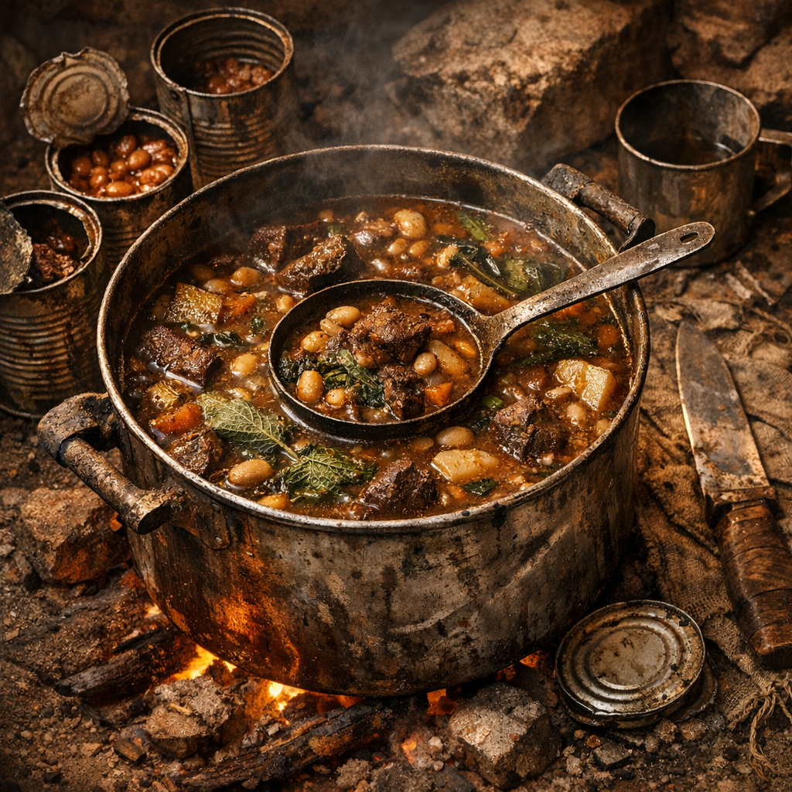

# Dosenacker-Eintopf

Ein schwerer Lagertopf für kalte Nächte, Wachwechsel und Tage, an denen niemand mehr so tut, als würde frisches Essen noch die Regel sein.

## Zutaten

- eine gute Handvoll gewürfeltes Fleisch von einem jungen [Rotzschwein](../Tiere/Rotzschweine.md), aus halbwegs lesbarem Boden gejagt oder als Billigfleisch am [Handelsposten](../../Kanon/glossar.md#handelsposten) ertauscht
- zwei bis drei Becher voll beliebiger Dosenfraß: Bohnen, Dosengemüse, Dosensuppe oder Fleischreste aus Plünderlagern, Karawanenkisten oder Postenküchen
- zwei Hände junger [Brennnesseln](../Pflanzen/Brennnessel.md), an Schutträndern, Gräben oder alten Mauerkanten gesammelt
- ein halber Becher klein geschnittene [Rohrkolben](../Pflanzen/Rohrkolben.md)-Rhizome oder junge Triebe, aus sauberen Uferstellen gezogen
- ein halber Blechbecher Wasser oder dünne Brühe
- eine Messerspitze Salz, falls irgendwo noch welches aufzutreiben ist
- ein Schuss Fett aus Dose, Speckrest oder altem Kochlöffelrand

## Zubereitung

Zuerst das Rotzschweinfleisch klein schneiden und in einem alten Topf oder einer abgeschnittenen Blechdose mit etwas Fett hart anrösten. Wenn es Farbe nimmt und nicht mehr roh riecht, die klein geschnittenen Rohrkolbenstücke dazugeben und kurz mitbraten.

Dann den gesamten Dosenfraß hineinkippen, mit Wasser oder Brühe verlängern und alles langsam köcheln lassen. Die Brennnesseln grob zusammendrücken, damit die Haare brechen, dann erst in den Topf geben. Wenn das Feuer knapp ist, den Topf an den Rand ziehen und länger ziehen lassen statt hart zu kochen.

Der Eintopf ist fertig, wenn das Fleisch weich genug wirkt, die Brühe dick wird und die Nessel nicht mehr sticht. In der [Wasteland](../../Kanon/glossar.md#wasteland) gilt: Wenn der Löffel im Topf kurz stehen will, reicht es.
