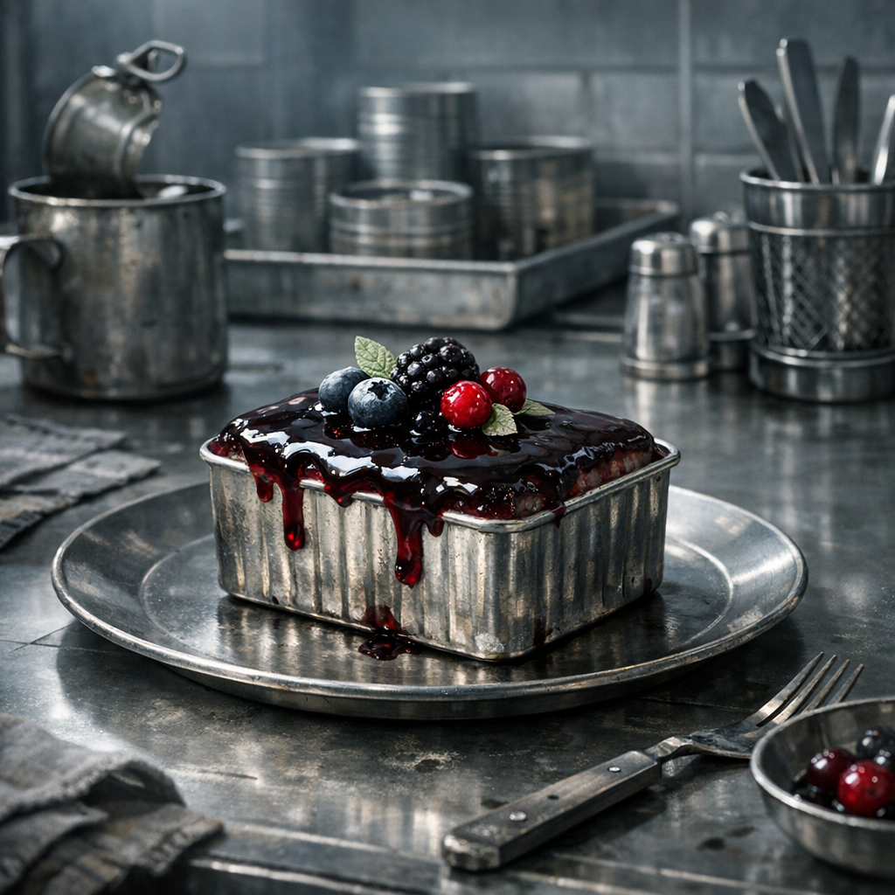

# Glaspforten-Blechpastete

Ein Zero-nahes Gericht: aus denselben knappen Dingen wie draußen, aber sauberer geschnitten, kühler angerichtet und mit gerade genug Arroganz serviert, dass es wie Luxus wirken soll.

## Zutaten

- eine Dose feineres Dosenfleisch, Fisch in Lake oder gepresste Proteinmasse aus kontrollierten Vorratslagern oder Zero-nahen Märkten
- eine halbe Hand voll [Brombeeren](../Pflanzen/Brombeere.md), möglichst unzerdrückt und sauber gesammelt
- ein kleiner Griff [Wilder Hopfen](../Pflanzen/Wilder-Hopfen.md), nur für Bittere
- ein halber Becher zerdrückter Dosenkartoffeln, Bohnenpüree oder anderer stärkehaltiger Konservenrest zum Binden
- ein kleiner Schuss [Prepper Pils](../Gegenstaende/Prepper-Pils.md), eher aus Ironie als aus Liebe
- ein Löffel Fett oder feines Dosenöl
- etwas sauberes Wasser aus Filter- oder Enklavenvorrat

## Zubereitung

Das Dosenfleisch fein zerteilen und mit dem Stärkebrei vermengen, bis eine glatte, formbare Masse entsteht. Einen kleinen Teil der Brombeeren zerdrücken und mit einem Schuss Prepper Pils, Wasser und wenigen Hopfenstücken kurz einkochen, bis daraus eine dunkle bittere Glasur wird.

Die Fleischmasse in eine flache, gefettete Dose oder Blechform drücken und dicht an die Glut stellen, bis sie fest wird. Danach vorsichtig herausheben oder direkt in der Form servieren. Die eingekochte Beerenglasur obenauf streichen und mit den übrigen Brombeeren besetzen.

Zero-Köche würden sagen, die Pastete ist fertig, wenn die Oberfläche glatt bleibt und nichts mehr nach Lager riecht. Alle anderen sagen einfach: Es ist immer noch Dosenfraß, aber sehr selbstbewusst.
