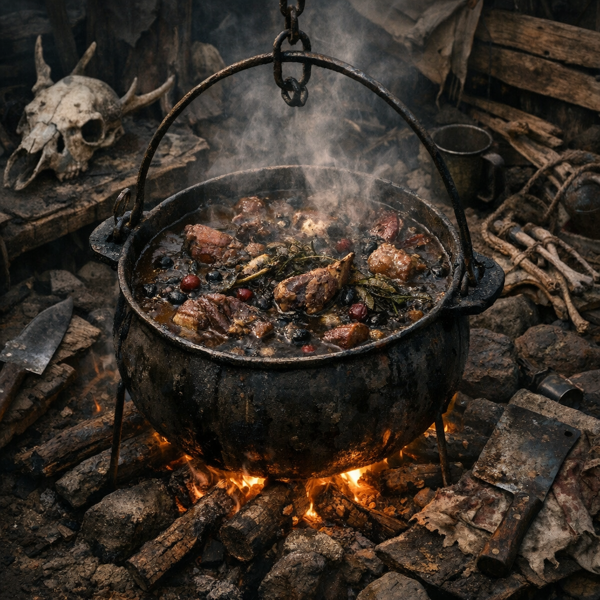

# Hexenkessel 2066

Ein Hillbilly-Gericht: schwer, bitter, dunkel und genau die Art von Topf, bei der niemand im Lager hinterher sicher sagen kann, ob es Mahlzeit, Mutprobe oder Ritual war.

## Zutaten

- zwei Hände Fleisch von einem jungen [Rotzschwein](../Tiere/Rotzschweine.md), selbst aus Randzonen gejagt oder als fragwürdige Ware von Waldposten bezogen
- eine Hand voll [Brombeeren](../Pflanzen/Brombeere.md), von Dornenfeldern an Waldrändern oder Hillbilly-Pfaden
- ein halber Griff [Beifuss](../Pflanzen/Beifuss.md), an trockenen Schutträndern oder Wegen gesammelt
- ein kleiner Griff [Wilder Hopfen](../Pflanzen/Wilder-Hopfen.md), von Zäunen, Ruinen und feuchten Lagerkanten
- eine halbe bis ganze Dose Bohnen oder irgendein dunkler Dosenfraß aus Plünderküchen oder Karawanenresten
- ein halber Becher [Prepper Pils](../Gegenstaende/Prepper-Pils.md) oder notfalls Wasser
- ein Löffel Fett, Schmalz oder altes Kesselfett

## Zubereitung

Das Rotzschweinfleisch grob würfeln und im Fett scharf anbraten, bis es dunkel und an den Kanten fast schwarz wird. Dann den Dosenfraß dazugeben und alles einmal gründlich durchrühren.

Beifuss und Hopfen zwischen den Fingern anquetschen, damit Bitterstoffe freiwerden, und mit den Brombeeren in den Topf geben. Mit Prepper Pils oder Wasser angießen und den Kessel an den Rand des Feuers stellen, wo er lange ziehen kann, ohne auszubrennen.

Die Hillbilly-Regel lautet: nicht auf Schönheit kochen, sondern auf Geruch. Wenn der Topf schwer, süß-bitter und fast harzig riecht, das Fleisch weich wird und die Beeren nur noch dunkle Schlieren ziehen, ist der Kessel fertig.
