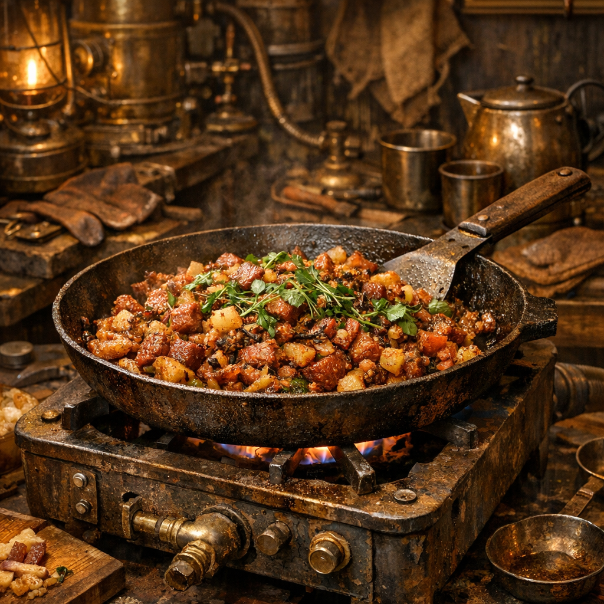

# Messingmarkt-Hash

Ein Steampunk-Gericht: alles Verwertbare kommt in eine Pfanne, aber so, dass es am Ende nach Absicht aussieht und nicht nach Abfallwirtschaft.

## Zutaten

- eine Dose Fleischreste, Corned-Beef-artige Masse oder gepresstes Eiweiß aus Händlerkisten oder Werkhofvorräten
- zwei Hände klein geschnittene [Rohrkolben](../Pflanzen/Rohrkolben.md)-Rhizome oder Triebe, aus Uferzonen oder von Sammlern angekauft
- eine Hand voll junge [Brennnesseln](../Pflanzen/Brennnessel.md), an Mauern, Drainagekanten oder Schutthöfen gesammelt
- ein kleiner Griff [Beifuss](../Pflanzen/Beifuss.md), als bitteres Werkhofkraut
- ein Stück [Birke](../Pflanzen/Birke.md) in Form von trockener Rinde oder ein kleiner Span, zum Räuchern oder für schnelles Zündfeuer
- ein Löffel Fett oder direkt das Dosenfett
- eine halbe Dose Bohnen, Mais oder Kartoffelbrei, wenn der Hash mehr Masse bekommen soll

## Zubereitung

Zuerst ein kleines, heißes Feuer aus Birkenrinde und Schrottspan anlegen. Dann die Rohrkolbenstücke in Fett anrösten, bis sie weich und an den Kanten goldbraun werden. Danach den Doseninhalt und auf Wunsch den zusätzlichen Dosenrest dazugeben und mit Messer oder Löffel zerdrücken.

Die Brennnesseln grob zerhacken und zusammen mit dem Beifuss in die Pfanne werfen. Alles flach drücken und ohne viel Rühren braten lassen, damit sich unten eine feste Kruste bildet. [Steampunks](../../Kanon/glossar.md#steampunks) sagen dazu nicht verbrannt, sondern versiegelt.

Fertig ist der Hash, wenn die Unterseite dunkel und knusprig wird und sich oben Fett und Kräutergeruch mischen. Gegessen wird direkt aus der Pfanne, oft mit Werkzeuggriff statt Besteck.
