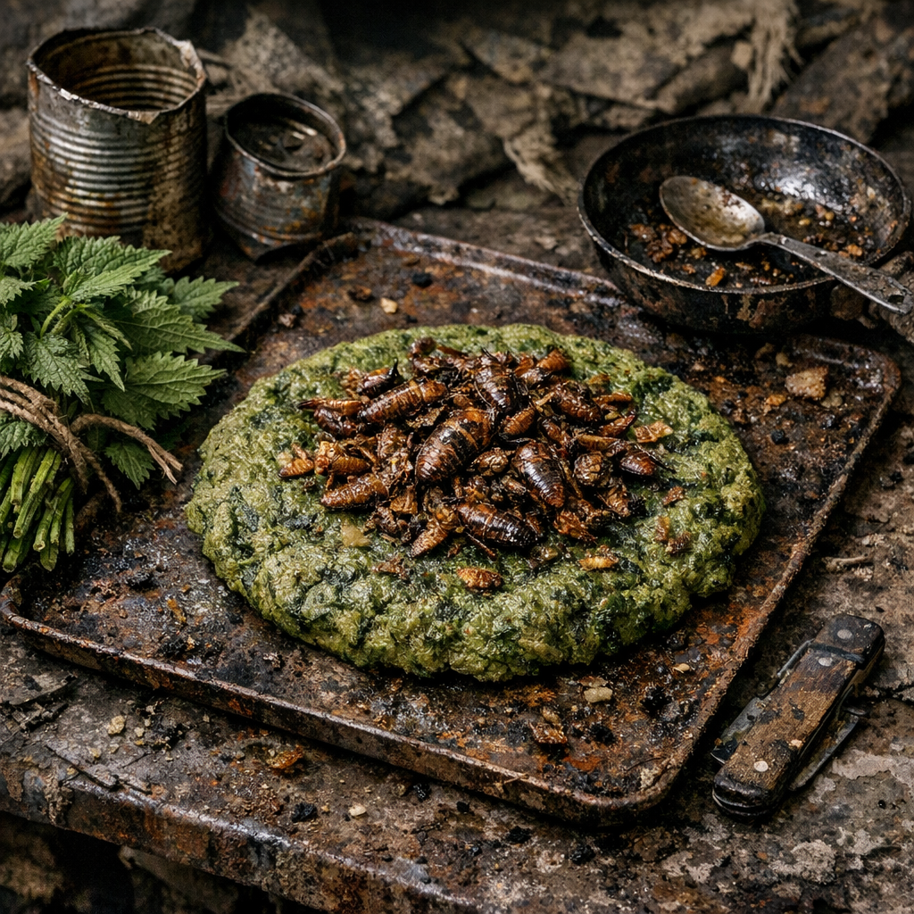

# Nesselblech mit Schaben-Crunch

Nichts an diesem Namen soll beruhigen. Es ist Lagerküche aus Mangel, aber eine, die satt macht und an manchen Posten fast schon als Spezialität gilt.

## Zutaten

- zwei Hände junge [Brennnesseln](../Pflanzen/Brennnessel.md), aus Gräben, Mauerkanten oder Nesselgassen gesammelt
- eine halbe Dose Dosenmehlbrei, Crackerstaub oder eingeweichte Altbackenreste
- ein halber Becher Wasser
- ein Löffel Fett oder Öl
- eine gute Hand voll gereinigte [Kakerlaken](../Tiere/Kakerlaken.md), aus trockenen, warmen Technikräumen oder als Billigprotein von fragwürdigen Händlern
- eine Prise Salz, Schärfepulver oder Aschepfeffer, wenn vorhanden

## Zubereitung

Die Brennnesseln mit etwas heißem Wasser zusammenfallen lassen und dann fein hacken. Mit dem Dosenbrei oder den eingeweichten Krümeln verrühren, bis ein dicker, zäher Teig entsteht. Falls er zu trocken ist, noch etwas Wasser zugeben.

Auf ein gefettetes Blech, eine flache Pfanne oder eine saubere Schrottplatte streichen und dicht am Feuer backen oder rösten, bis die Unterseite fest wird. Danach wenden oder mit Glut von oben nachziehen lassen.

Währenddessen die gereinigten Kakerlaken in einer kleinen Dose oder Pfanne trocken rösten, bis Panzer und Beine knusprig werden. Leicht salzen und über das fertige Nesselblech streuen.

Fertig ist es, wenn der grüne Fladen nicht mehr schmatzt und die Schaben beim Kauen knackig brechen.
